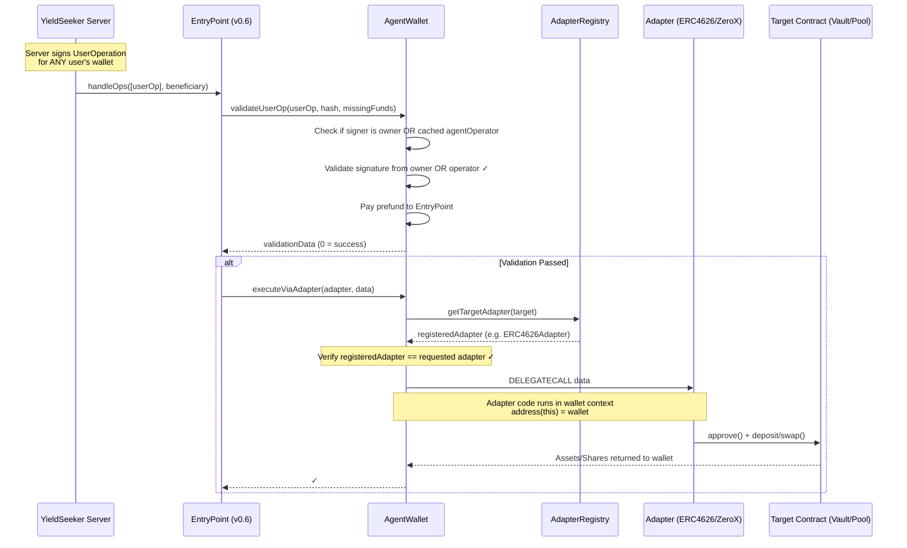
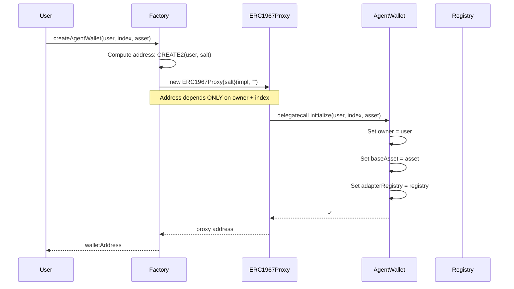
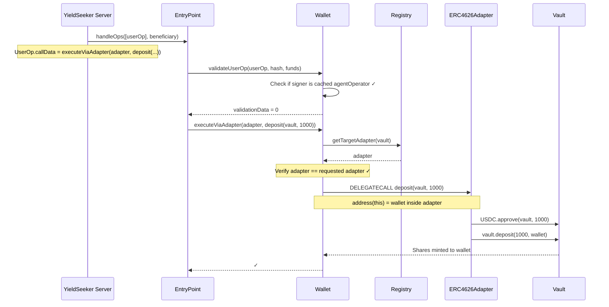

# YieldSeeker Agent Wallet System v4

## Overview

This is a **parameter-level validated smart wallet system** for autonomous agents with **centralized server authorization**. Unlike traditional smart wallets that only restrict which _functions_ can be called, this system validates the _parameters_ of each call and supports a centralized server that can manage multiple wallets without individual configuration.

### The Problem with Traditional Smart Wallets

Consider an AI agent that autonomously moves USDC between yield vaults to maximize returns. To deposit into a vault, the agent needs to:

1. Call `USDC.approve(vault, amount)` - allow the vault to pull USDC
2. Call `vault.deposit(amount)` - trigger the deposit

Traditional smart wallets with operator permissions handle this by whitelisting functions:

```
Admin configures:
  ✓ Allow operator to call USDC.approve(spender, amount)
  ✓ Allow operator to call YearnVault.deposit(amount)
  ✓ Allow operator to call AavePool.supply(asset, amount, ...)
```

**The Problem**: The wallet allows `USDC.approve()` but cannot restrict the `spender` parameter. A malicious or compromised operator can:

```solidity
// Operator calls (perfectly "allowed" by traditional wallet):
USDC.approve(ATTACKER_CONTRACT, type(uint256).max);

// Attacker contract then drains all USDC:
USDC.transferFrom(wallet, attacker, USDC.balanceOf(wallet));
```

The wallet approved the call because `approve` was on the allowlist. It had no way to validate that the spender should only be a trusted vault.

### Our Solution: Adapter-Based Execution with Onchain Proof

Our system uses a layered validation approach:

**Core Security Principles:**
1. **No Arbitrary Execution**: Standard `execute()` and `executeBatch()` functions are **disabled**
2. **Adapter Validation**: All actions must go through `executeViaAdapter()` which validates the adapter is registered
3. **Target Validation**: Adapters validate that targets (vaults, pools) are registered for that specific adapter
4. **Server Authorization**: A centralized `yieldSeekerServer` can sign UserOperations for any wallet, enabling easy key rotation

**Example Flow:**
- Server signs UserOperation: `wallet.executeViaAdapter(ERC4626Adapter, deposit(MorphoVault, 1000))`
- Wallet validates signature is from owner OR yieldSeekerServer
- Wallet checks: `registry.getTargetAdapter(MorphoVault)` → returns `ERC4626Adapter` ✓
- Wallet verifies returned adapter matches the requested adapter ✓
- Wallet DELEGATECALLs adapter code into wallet context
- Adapter executes: `approve()` + `deposit()` in wallet's context

**Why this works:**
- Server can only call registered adapters
- Adapters can only operate on targets registered for them in the registry
- Solidity enforces function signatures - no arbitrary calldata
- Amounts are user-controlled (intentional)
- Single server key can manage all wallets without individual configuration

### Emergency Controls and Stale Cache Mitigation

The system uses a **caching mechanism** for performance and ERC-4337 compliance (avoiding external calls during validation). Wallets cache the `agentOperator` list and `adapterRegistry` address locally for gas efficiency.

#### Known Limitation: Operator Revocation Propagation Delay

**The Trade-off**: When an operator is revoked at the Factory, existing wallets continue trusting that operator until `syncFromFactory()` is manually called on each wallet. This creates a time window where a revoked operator can still execute operations.

**Why This Exists**:
- ERC-4337 validation has strict gas limits (~50k gas)
- External calls during validation would make UserOps too expensive
- Checking local storage (`isAgentOperator`) costs ~2,100 gas vs ~10,000+ for external calls

**Exposure Window**:
1. Admin initiates operator revocation via timelock (24h delay minimum)
2. Revocation executes on Factory
3. Revoked operator can act until each wallet owner calls `syncFromFactory()`

**Accepted Risk**: This is a medium-severity limitation that requires both a malicious operator AND owner negligence (not syncing). The system accepts this trade-off for gas efficiency.

**Mitigations in Place**:

1. **Global Kill Switch**: The `AdapterRegistry` serves as an emergency brake
   - All adapter actions call `registry.getTargetAdapter(target)`
   - Registry is `Pausable` by admin
   - **If operator compromised**: Admin pauses registry → all agent actions stop globally, regardless of stale cache
   - Wallets can be synced/upgraded while paused, then resume operations

2. **Timelock Warning Period**:
   - 24+ hour timelock on revocations gives advance notice
   - Monitoring systems can detect and alert owners
   - Owners can proactively sync before revocation takes effect

3. **Limited Operator Permissions**:
   - Operators cannot withdraw funds to arbitrary addresses (only owner can)
   - Operators cannot upgrade wallets (only owner can)
   - Operators can only interact with registered adapters and targets

**Operational Guidance**:
- **For Wallet Owners**: Call `syncFromFactory()` when notified of operator changes
- **For Platform**:
  - Monitor Factory events and alert wallet owners
  - Provide prominent "Sync" button in dashboard UI
  - Consider automated backend service to call `syncFromFactory()` on all wallets after operator changes
  - Monitor revoked operators for suspicious activity during sync window
- **For Incident Response**: Have runbook ready to pause registry and mass-sync all wallets if operator compromised

### Standards Compliance

| Standard | Purpose |
|----------|---------|
| **ERC-4337** | Account Abstraction - gas sponsorship, UserOperations |
| **UUPS** | Upgradeable Proxies - user-controlled wallet upgrades |
| **ERC-7201** | Namespaced Storage - safe upgrades without storage collisions |

---

## Deployment & Security Requirements

### Chain Compatibility
This system is designed for EVM-compatible chains that have implemented **EIP-6780** (introduced in the Dencun upgrade), such as **Base Mainnet**.

**Why EIP-6780 is required:**
The security model relies on `delegatecall` to whitelisted adapter addresses. On chains without EIP-6780, a malicious adapter could potentially `selfdestruct` and be replaced by a different contract at the same address using `CREATE2`. EIP-6780 significantly mitigates this by restricting `selfdestruct` to only work within the same transaction the contract was created.

**PUSH0 Opcode Compatibility:**
The contracts use Solidity `0.8.28`, which defaults to the `shanghai` EVM version (including the `PUSH0` opcode). While supported on Base and most modern L2s, if deploying to older or specific EVM-compatible chains that do not support `PUSH0`, the compiler's `evm_version` must be explicitly set to `paris` or earlier to avoid deployment failure.

### Adapter Requirements
- **Immutability**: All registered adapters MUST be immutable. They should not have upgradeability patterns (like `UUPS` or `TransparentProxy`) unless the proxy admin is the same as the `AdapterRegistry` admin.
- **No Self-Destruct**: Adapters MUST NOT contain the `selfdestruct` opcode.
- **Validation**: Adapters MUST follow the "Peek and Verify" pattern, taking the `target` address as their first argument to allow the `AgentWallet` to validate the call against the `AdapterRegistry`.
- **Stateless Design**: Adapters are designed to be **stateless code libraries** that execute via `delegatecall`. They should NEVER hold funds (ETH or tokens). All assets remain in the AgentWallet during adapter execution.

### Adapter Fund Handling

**Important**: Adapter contracts themselves should never receive direct transfers of ETH or tokens.

**How Adapters Work**:
- Adapters execute via `DELEGATECALL` from AgentWallet
- During delegatecall: `address(this)` = wallet address, NOT adapter address
- All funds remain in the wallet's balance throughout execution
- The `payable` modifier on adapter functions is necessary for native ETH operations (e.g., swaps involving ETH) but the ETH stays in the wallet context

**Direct Transfer Risk**:
If someone mistakenly sends ETH or tokens directly to an adapter contract address (e.g., `address(merklAdapter).transfer(1 ether)`), those funds will be locked permanently. This is user error equivalent to sending funds to any immutable contract address.

**Protection**:
- Adapters have `onlyDelegateCall` modifier - direct function calls are blocked and will revert
- Only delegatecalls from AgentWallet can execute adapter code
- AgentWallet has proper `withdrawEthToUser()` and `withdrawBaseAssetToUser()` functions for fund recovery

**Operational Guidance**: Never send funds directly to adapter contract addresses. All operations should go through `AgentWallet.executeViaAdapter()`.

### Technical Stack
- **Solidity Version**: `0.8.28`
- **Framework**: Foundry
- **ERC-4337 Version**: v0.6

---

## Fee Model

The system implements a **performance-based fee model** tracked on-chain via the `FeeTracker`. Fees are calculated based on **realized yield** rather than total assets under management.

### Lifecycle of a Fee
1. **Recording Cost Basis**: When an adapter performs a deposit (e.g., into a Morpho vault), it calls `FeeTracker.recordVaultShareDeposit()`. This records the `assetAmount` (cost basis) and the `sharesReceived`.
2. **Tracking Yield**: As the vault earns interest, the value of the shares increases. This yield remains "unrealized" until a withdrawal occurs.
3. **Realizing Yield**: When an adapter performs a withdrawal, it calls `FeeTracker.recordVaultShareWithdraw()`. The feeTracker calculates the difference between the current asset value of the shares and their original cost basis.
4. **Fee Calculation**: If the withdrawal results in a profit, the configured `feeRateBps` (e.g., 10% or 1000 BPS) is applied to the profit and added to the wallet's `feesOwed`.
5. **Fee Collection**: The `feeCollector` (configured in the `FeeTracker`) can call `AgentWallet.collectFees()` to transfer the accumulated fees from the wallet to the collector address.

### Key Properties
- **Loss Protection**: If a withdrawal results in a loss, the cost basis for remaining shares is adjusted, and no fees are accrued.
- **Transparency**: Users can query `feeTracker().getFeesOwed(wallet)` at any time to see their outstanding fee balance.
- **Non-Custodial**: Fees are only collected from the wallet's balance; the platform never has direct custody of user funds beyond the earned fees.

---

## Architecture Overview

### Execution Flow



### Key Architecture Points

- **Disabled Standard Execution**: `execute()` and `executeBatch()` revert with `NotAllowed`
- **Adapter-Only Execution**: All operations must go through `executeViaAdapter()`
- **Registry Validation**: Adapters must be registered, targets must be registered for that adapter
- **DELEGATECALL Context**: Adapter code runs in wallet's context (`address(this)` = wallet)
- **Server Authorization**: Registry stores `yieldSeekerServer` address that can sign for any wallet
- **ERC-4337 Compatible**: Full support for UserOperations and gas sponsorship

### System Constants

| Constant | Value | Contract | Description |
|----------|-------|----------|-------------|
| `MAX_OPERATORS` | 10 | AgentWalletFactory | Maximum number of agent operators |
| `MAX_FEE_RATE_BPS` | 5000 | FeeTracker | Maximum fee rate (50%) |

---

## Contract Reference

### Core Contracts

#### AgentWallet (`src/AgentWallet.sol`)

The user's smart wallet that holds funds and executes validated operations.

**Inheritance Chain:**
```
BaseAccount (ERC-4337) → Initializable → UUPSUpgradeable
```

**Storage (ERC-7201 Namespaced):**
| Field | Type | Description |
|-------|------|-------------|
| `owner` | `address` | Wallet owner (can withdraw, upgrade) |
| `ownerAgentIndex` | `uint256` | Index of this agent for the owner |
| `baseAsset` | `IERC20` | The primary asset this agent manages (e.g. USDC) |
| `adapterRegistry` | `AdapterRegistry` | Cached reference to AdapterRegistry from Factory |
| `feeTracker` | `FeeTracker` | Cached reference to FeeTracker from Factory |
| `agentOperators` | `address[]` | Cached list of authorized operators from Factory |
| `isAgentOperator` | `mapping(address => bool)` | Fast lookup for operator status |
| `blockedAdapters` | `mapping(address => bool)` | User-level adapter blocklist |
| `blockedTargets` | `mapping(address => bool)` | User-level target blocklist |

**Events:**
```solidity
event SyncedFromFactory(address indexed adapterRegistry, address indexed feeTracker);
```

**Key Functions:**

| Function | Access | Description |
|----------|--------|-------------|
| `initialize(owner, index, asset)` | Factory only | Sets up wallet and syncs config from Factory |
| `executeViaAdapter(adapter, target, data)` | Executors | Execute via registered adapter (DELEGATECALL) |
| `executeViaAdapterBatch(adapters[], targets[], datas[])` | Executors | Execute multiple adapter calls in a batch |
| `validateUserOp(userOp, hash, funds)` | EntryPoint | ERC-4337 signature validation (owner OR operator) |
| `blockAdapter(adapter)` | Owner only | Block an adapter from being used by this wallet |
| `unblockAdapter(adapter)` | Owner only | Unblock a previously blocked adapter |
| `blockTarget(target)` | Owner only | Block a target from being accessed by this wallet |
| `unblockTarget(target)` | Owner only | Unblock a previously blocked target |
| `isAdapterBlocked(adapter)` | View | Check if an adapter is blocked |
| `isTargetBlocked(target)` | View | Check if a target is blocked |
| `syncFromFactory()` | Syncers | Refresh cached operators and registry address |
| `collectFees()` | Executors | Transfer accumulated fees to fee collector (any executor can call) |
| `withdrawBaseAssetToUser(recipient, amount)` | Owner only | User withdraws base asset (minus fees owed) |
| `withdrawAllBaseAssetToUser(recipient)` | Owner only | User withdraws all base asset (minus fees owed) |
| `withdrawEthToUser(recipient, amount)` | Owner only | User withdraws ETH |
| `withdrawAllEthToUser(recipient)` | Owner only | User withdraws all ETH |
| `upgradeToLatest()` | Owner only | Upgrade to latest factory-approved implementation |
| `upgradeTo()` / `upgradeToAndCall()` | Owner only | UUPS upgrade functions (factory-approved impl only) |
| `execute()` | **DISABLED** | Reverts with `NotAllowed` |
| `executeBatch()` | **DISABLED** | Reverts with `NotAllowed` |

**Upgrade Authorization Model:**

Wallet upgrades follow a user-sovereignty model that ensures owners maintain complete control:

- **Who Can Upgrade**: ONLY the wallet owner can trigger upgrades
- **What They Can Upgrade To**: ONLY factory-approved implementations (not arbitrary contracts)
- **Timelock Protection**: Factory uses AdminTimelock with 24+ hour delay on implementation updates
- **User Protection Window**: Users have 24+ hours notice before new implementations become available
- **Exit Right**: During the timelock period, owners can withdraw all funds if they reject the upgrade

This design ensures:
- Users maintain complete sovereignty over their wallets
- No third party can force upgrades (aligns with "verify, don't trust")
- Security through factory approval and timelock notice period
- Users can choose to upgrade, wait, or exit entirely

**Operator Authorization:**
The wallet validates UserOperation signatures from either:
1. The wallet's owner (user's EOA)
2. Any address in the cached `agentOperators` list (synced from Factory)

**Important**: The operator list is cached locally for gas efficiency. After operator changes at the Factory level, wallets must call `syncFromFactory()` to refresh their cache. See [Emergency Controls](#emergency-controls-and-stale-cache-mitigation) for details on this limitation and mitigations.

---

#### AgentWalletFactory (`src/AgentWalletFactory.sol`)

Deploys new agent wallets as ERC1967 proxies and manages global configuration.

**Roles:**
| Role | Description |
|------|-------------|
| `DEFAULT_ADMIN_ROLE` | Manages implementation, registry, and roles |
| `AGENT_OPERATOR_ROLE` | Authorized to create wallets and sign for agents |

**Key Functions:**

| Function | Access | Description |
|----------|--------|-------------|
| `createAgentWallet(owner, index, asset)` | Operator | Deploys new wallet via CREATE2 |
| `getAddress(owner, index)` | View | Predicts address before deployment |
| `setAgentWalletImplementation(newImpl)` | Admin | Updates implementation for NEW wallets |
| `setAdapterRegistry(newRegistry)` | Admin | Updates registry for NEW wallets |
| `setFeeTracker(newTracker)` | Admin | Updates fee tracker for NEW wallets |

**Features:**
- **Deterministic Addresses**: Same owner + index = same address across chains (Asset-agnostic)
- **User Sovereignty**: Factory cannot force-upgrade existing wallets
- **ERC-4337 Compatible**: Implements `IEntryPoint.getSenderAddress()` pattern

---

#### AdapterRegistry (`src/AdapterRegistry.sol`)

The central registry that manages authorized adapters and their targets.

**Roles:**
| Role | Description |
|------|-------------|
| `DEFAULT_ADMIN_ROLE` | Can register adapters and targets |
| `EMERGENCY_ROLE` | Can remove targets/adapters and pause instantly |

**Key Functions:**

| Function | Access | Description |
|----------|--------|-------------|
| `registerAdapter(adapter)` | Admin | Register a new adapter contract |
| `setTargetAdapter(target, adapter)` | Admin | Map a target (vault/pool) to its adapter |
| `removeTarget(target)` | Emergency | Remove target mapping instantly |
| `unregisterAdapter(adapter)` | Emergency | Disable adapter (mappings preserved for re-registration) |
| `pause()` / `unpause()` | Emergency / Admin | Emergency pause/unpause |
| `getTargetAdapter(target)` | View | Returns adapter for target (reverts if paused) |
| `getAllTargets()` | View | Returns list of all registered targets |

**Important Behavior Notes:**

*Adapter Unregistration:*
- `unregisterAdapter()` marks an adapter as disabled, immediately preventing all wallets from using it
- However, target→adapter mappings are NOT cleared from storage (by design for gas efficiency)
- If the same adapter is later re-registered, ALL previous target mappings are automatically reactivated
- This is intentional: unregister is for emergency shutdowns, not permanent removal
- For permanent removal of specific targets, use `removeTarget()` after unregistering the adapter

**Resolution Flow:**
1. Wallet extracts `target` from calldata.
2. Wallet calls `registry.getTargetAdapter(target)` → must return the requested `adapter`.
3. If registry is **paused**, all adapter actions revert globally.

---

#### FeeTracker (`src/FeeTracker.sol`)

Tracks fees and yields for agent wallets on a cost-basis accounting model.

**Key Functions:**

| Function | Access | Description |
|----------|--------|-------------|
| `setFeeConfig(rateBps, collector)` | Admin | Set fee rate (max 50%) and collector address |
| `recordAgentVaultShareDeposit(vault, assetsDeposited, sharesReceived)` | Wallet | Record cost basis when depositing to vault |
| `recordAgentVaultShareWithdraw(vault, sharesSpent, assetsReceived)` | Wallet | Calculate yield/loss and accrue fees |
| `recordAgentYieldEarned(amount)` | Wallet | Record yield earned in base asset |
| `recordAgentYieldTokenEarned(token, amount)` | Wallet | Track yield tokens received (fees owed in token) |
| `recordAgentTokenSwap(swappedToken, swappedAmount, baseAssetReceived)` | Wallet | Convert yield token fees to base asset fees |
| `recordFeePaid(amount)` | Wallet | Record fee payment from wallet |
| `getFeesOwed(wallet)` | View | Query outstanding fees owed by wallet |
| `getAgentVaultPosition(wallet, vault)` | View | Get cost basis and shares for a vault position |
| `getAgentYieldTokenFeesOwed(wallet, token)` | View | Get fees owed in a specific yield token |

**Features:**
- Cost-basis tracking for vault positions
- Loss protection: fees only on net profits
- Reward token tracking separate from base asset
- Transparent on-chain accounting
- Maximum fee rate: 50% (5000 basis points)

---

### Adapters (`src/adapters/`)

Adapters are stateless contracts that execute protocol interactions via DELEGATECALL. They inherit from adapter base classes to enforce security constraints and provide common functionality.

#### Base Classes

**YieldSeekerAdapter (`src/adapters/Adapter.sol`)**
Abstract base class for all adapters providing:
- `onlyDelegateCall` modifier to prevent direct calls
- Helper functions: `_agentWallet()`, `_baseAsset()`, `_feeTracker()`
- Base asset validation: `_requireBaseAsset(address)`

**YieldSeekerVaultAdapter (`src/adapters/VaultAdapter.sol`)**
Abstract base class for vault-type adapters extending `YieldSeekerAdapter` with:
- Standard vault interface: `deposit()`, `depositPercentage()`, `withdraw()`
- Consistent fee tracking integration
- Event emission for vault operations

#### Concrete Adapters

#### ERC4626Adapter (`src/adapters/ERC4626Adapter.sol`)

For Yearn V3, MetaMorpho, Morpho Blue, and other ERC4626 vaults.

**Functions:**
- `deposit(vault, assetAmount)` - Deposit base asset into vault
- `depositPercentage(vault, percentageBps)` - Deposit percentage of wallet balance
- `withdraw(vault, shareAmount)` - Withdraw shares from vault

**Validation:**
- Enforces that the vault's underlying asset matches the wallet's `baseAsset`
- Calls FeeTracker to record deposits/withdrawals for fee calculation

#### ZeroXAdapter (`src/adapters/ZeroXAdapter.sol`)

For 0x API v2 swaps.

**Functions:**
- `swap(sellToken, buyToken, sellAmount, minBuyAmount, swapCallData, value)` - Execute 0x swap

**Validation:**
- Enforces that the `buyToken` must be the wallet's `baseAsset` (ensures swaps always result in base asset)
- Validates the 0x `allowanceTarget`
- Prevents ETH value parameter manipulation for security

#### MerklAdapter (`src/adapters/MerklAdapter.sol`)

For claiming protocol rewards via Merkl distributor.

**Functions:**
- `claim(users, tokens, amounts, proofs)` - Claim rewards from Merkl

**Validation:**
- No base asset validation (reward tokens can be any token)
- Calls FeeTracker to record reward tokens received

---

## Security Model

### Actors

| Actor | Description |
|-------|-------------|
| **User** | EOA that owns a wallet. Can withdraw funds and upgrade their wallet. |
| **YieldSeeker Server** | Centralized backend service that can sign UserOperations for ANY wallet. |
| **Platform Admin** | Manages the AdapterRegistry and Factory. |
| **Emergency Admin** | Can instantly pause, remove adapters, or targets in case of compromise. |

---

### Permissions by Contract

#### AgentWallet

| Action | User (Owner) | YieldSeeker Server | Platform Admin | Anyone |
|--------|:------------:|:------------------:|:--------------:|:------:|
| `withdrawBaseAssetToUser()` | ✅ | ❌ | ❌ | ❌ |
| `withdrawAllBaseAssetToUser()` | ✅ | ❌ | ❌ | ❌ |
| `withdrawEthToUser()` | ✅ | ❌ | ❌ | ❌ |
| `withdrawAllEthToUser()` | ✅ | ❌ | ❌ | ❌ |
| `upgradeToAndCall()` | ✅ | ❌ | ❌ | ❌ |
| `executeViaAdapter()` | via EntryPoint | via EntryPoint | ❌ | ❌ |
| `validateUserOp()` | ✅ (signs) | ✅ (signs) | ❌ | ❌ |
| `execute()` | ❌ (DISABLED) | ❌ (DISABLED) | ❌ | ❌ |
| Receive deposits | ✅ | ✅ | ✅ | ✅ |

---

#### AgentWalletFactory

| Action | Role Required | Description |
|--------|---------------|-------------|
| `createAgentWallet()` | AGENT_OPERATOR_ROLE | Deploy new wallet for a user |
| `setAgentWalletImplementation()` | DEFAULT_ADMIN_ROLE | Update implementation for NEW wallets |
| `setAdapterRegistry()` | DEFAULT_ADMIN_ROLE | Update registry for NEW wallets |
| `setFeeTracker()` | DEFAULT_ADMIN_ROLE | Update fee tracker for NEW wallets |

---

#### AdapterRegistry

| Action | Role Required | Timing | Description |
|--------|---------------|--------|-------------|
| `registerAdapter()` | `DEFAULT_ADMIN_ROLE` | Normal | Register a new adapter |
| `unregisterAdapter()` | `EMERGENCY_ROLE` | Instant | Remove adapter immediately |
| `setTargetAdapter()` | `DEFAULT_ADMIN_ROLE` | Normal | Map target → adapter |
| `removeTarget()` | `EMERGENCY_ROLE` | Instant | Remove target mapping immediately |
| `pause()` / `unpause()` | `EMERGENCY_ROLE` / `DEFAULT_ADMIN_ROLE` | Instant | Emergency pause/unpause |
| `getTargetAdapter()` | Anyone (view) | N/A | Check target and return its adapter |

---

### What Each Actor Can Achieve

#### User (Wallet Owner)
✅ **CAN:**
- Withdraw any token or ETH to any address
- Trigger wallet upgrades to factory-approved implementations (anyone can)
- Transfer ownership to another address
- Receive funds from anyone
- Sign UserOperations to execute adapter actions

❌ **CANNOT:**
- Execute arbitrary calls (execute/executeBatch disabled)
- Upgrade to non-factory-approved implementations
- Modify AdapterRegistry configurations
- Affect other users' wallets

---

#### YieldSeeker Server
✅ **CAN:**
- Sign UserOperations for ANY wallet (no per-wallet configuration needed)
- Execute actions via registered adapters:
  - Deposit to registered vaults
  - Withdraw from registered vaults
  - Supply to registered pools
- Manage yield strategies across all wallets with single key

❌ **CANNOT:**
- Withdraw funds (only owner can call `withdrawBaseAssetToUser()`)
- Approve tokens to non-registered contracts
- Transfer tokens directly
- Call adapters or targets not registered in AdapterRegistry
- Execute standard `execute()` or `executeBatch()` (disabled)

**Note on Upgrades:** While operators (and anyone else) CAN trigger wallet upgrades, they are restricted to factory-approved implementations only. The factory uses a timelock (24h+ delay), giving users advance notice to withdraw funds if they reject a new implementation.

---

#### Platform Admin (DEFAULT_ADMIN_ROLE)
✅ **CAN:**
- Register new adapters
- Register new targets (vaults, pools)
- Update target-to-adapter mappings
- Grant/revoke admin roles

❌ **CANNOT:**
- Access user funds directly
- Force-upgrade existing wallets
- Execute actions on wallets

---

#### Emergency Admin (EMERGENCY_ROLE)
✅ **CAN (instantly):**
- Pause the registry (blocks all adapter validation)
- Remove adapters
- Remove target registrations

❌ **CANNOT:**
- Add new adapters or registrations
- Access user funds
- Grant or revoke roles
- Execute actions on wallets

---

### Security Considerations & Trust Model

While the system is designed to be as trustless as possible, it operates under a specific trust model:

#### 1. Trust in the YieldSeeker Server
The server is an authorized `agentOperator`. While it **cannot steal funds** (it cannot call `withdrawBaseAssetToUser` or approve tokens to arbitrary addresses), it has the power to:
- **Griefing**: The server could execute sub-optimal swaps or enter/exit vault positions frequently to waste gas.
- **Stale Cache**: If a server key is revoked in the Factory, the wallet must be `syncFromFactory()` to stop trusting it. The `AdapterRegistry` pause serves as the primary mitigation for this.

#### 2. Trust in the Platform Admin
The Admin manages the `AdapterRegistry`. They have the power to:
- **Add Malicious Adapters**: If an admin registers a malicious adapter, they could potentially drain wallets via `delegatecall`.
- **Add Malicious Targets**: If an admin maps a malicious contract as a "vault" to a legitimate adapter, the adapter might be tricked into approving tokens to that malicious contract.
- **Mitigation**: All critical admin actions are behind an `AdminTimelock`, giving users time to withdraw funds if they disagree with a registry change.

#### 3. Adapter Immutability
The security of `delegatecall` relies entirely on the code at the adapter address.
- **Requirement**: Adapters must be **immutable** and **non-upgradeable**.
- **Requirement**: Adapters must not contain `selfdestruct` (mitigated by EIP-6780 on Base).

#### 4. User Sovereignty

The user (Owner) maintains ultimate control over their wallet through multiple mechanisms:

**Withdrawal Rights:**
- The owner can always bypass adapters and withdraw all funds
- Withdrawal functions check fees owed and ensure users can always access their net balance

**Upgrade Control:**
- Only factory-approved implementations can be used (timelock protected)
- Owner has 24+ hour notice before new implementations become available
- During notice period, owner can withdraw all funds if rejecting an upgrade

**Adapter/Target Blocklists:**
- Owner can block specific adapters from being used by their wallet: `blockAdapter(address)`
- Owner can block specific targets (vaults/protocols) from being accessed: `blockTarget(address)`
- Blocklists are checked BEFORE global registry validation
- Provides granular control even when adapters/targets are globally approved
- Example use cases:
  - Block a risky vault while keeping other vaults accessible
  - Temporarily disable a specific adapter if suspicious behavior detected
  - Proactively block protocols before global admin responds

**Blocklist Functions:**
```solidity
// Block an adapter
wallet.blockAdapter(riskAdapter);

// Block a specific vault
wallet.blockTarget(suspiciousVault);

// Unblock when safe
wallet.unblockAdapter(riskAdapter);
wallet.unblockTarget(suspiciousVault);

// Query blocklist status
bool blocked = wallet.isAdapterBlocked(adapter);
bool blocked = wallet.isTargetBlocked(target);
```

**Sovereignty Philosophy:**
This embodies the crypto ethos of "verify, don't trust." While the global registry provides baseline security, users don't have to trust admin decisions. They can independently verify and block any adapter or target they deem risky, maintaining full sovereignty over their agent's operations.

**Configuration Sync:**
- Owner can call `syncFromFactory()` to update their local security state if global configuration changes

---

## Example Flows

### Flow 1: Agent Wallet Creation

**Actors:**
- User (EOA that will own the wallet)
- Anyone (can call factory)

**Pre-requisites:**
- Factory deployed with implementation

**Sequence:**



**Result:**
- New wallet deployed at deterministic address (Asset-agnostic)
- User is owner (can withdraw, upgrade)
- Wallet ready to receive deposits
- Server can sign UserOperations for this wallet (no configuration needed)

**Code Example:**
```solidity
// Anyone with AGENT_OPERATOR_ROLE can create wallet for user
address walletAddr = factory.createAgentWallet(
    userAddress,     // Owner
    0,               // Index
    usdcAddress      // Base Asset
);

// User can now deposit USDC
IERC20(USDC).transfer(walletAddr, 1000e6);

// Server can immediately manage this wallet (no setup needed)
```

---

### Flow 2: User Deposits USDC, Server Manages Vault Positions

**Actors:**
- User (EOA that owns the wallet)
- YieldSeeker Server (signs UserOperations)

**Pre-requisites:**
- Agent wallet already created for user
- ERC4626Adapter registered in AdapterRegistry
- Target vault registered in AdapterRegistry (mapped to ERC4626Adapter)
- Server address set as `agentOperator` in Factory

**Step 1: User deposits USDC to their wallet**
```solidity
// User sends 1000 USDC to their agent wallet
IERC20(USDC).transfer(walletAddress, 1000e6);
```

**Step 2: Server deposits USDC into ERC4626 vault**



**Step 3: Server withdraws from vault (e.g., moving to better yield)**

```solidity
// Server signs UserOperation to withdraw shares from vault
uint256 shares = IERC20(morphoVault).balanceOf(walletAddress);

// UserOp.callData:
wallet.executeViaAdapter(
    address(erc4626Adapter),
    abi.encodeCall(ERC4626Adapter.withdraw, (morphoVault, shares))
);
// Wallet now holds USDC again (with any yield earned)
```

**Result:**
- User's USDC was deposited to vault
- Vault shares were held in the wallet (earning yield)
- Server withdrew back to USDC
- User's wallet now contains original USDC + any yield earned
- At any point, user could call `withdrawBaseAssetToUser()` to withdraw their funds

**Security Notes:**
- Server can only interact with whitelisted vaults
- Server cannot withdraw funds to arbitrary addresses
- Server cannot transfer tokens directly out of wallet
- User retains full control and can withdraw at any time
- Single server key manages all wallets (no per-wallet configuration)

---

## Deployment

### Step 1: Deploy Core Contracts

```bash
# Set environment variables
export DEPLOYER_PRIVATE_KEY=<your-private-key>
export ADMIN_ADDRESS=<admin-multisig>
export ENTRY_POINT=0x5FF137D4b0FDCD49DcA30c7CF57E578a026d2789  # v0.6

# Deploy
forge script script/Deploy.s.sol --rpc-url <RPC_URL> --broadcast
```

This deploys:
- `AdapterRegistry`
- `AgentWallet` (implementation)
- `AgentWalletFactory`
- `ERC4626Adapter`
- `ZeroXAdapter`

### Step 2: Configure Registry

```bash
# Set additional env vars from Step 1 output
export REGISTRY_ADDRESS=<deployed-registry>
export ERC4626_ADAPTER=<deployed-erc4626-adapter>

# Register adapters
cast send $REGISTRY_ADDRESS "registerAdapter(address)" $ERC4626_ADAPTER --private-key $DEPLOYER_PRIVATE_KEY
```

### Step 3: Register Targets

```bash
# Register vaults
export MORPHO_VAULT=<morpho-vault-address>

cast send $REGISTRY_ADDRESS "setTargetAdapter(address,address)" $MORPHO_VAULT $ERC4626_ADAPTER --private-key $DEPLOYER_PRIVATE_KEY
```

---

## Development

### Requirements
- Foundry

### Running Tests
```bash
forge test -vvv
```

### Test Coverage

We have comprehensive tests in `test/`:

| Test File | Description |
|-----------|-------------|
| `Integration.t.sol` | Full lifecycle tests (create wallet, deposit, withdraw) |

**Key Tests:**
- ✅ Happy path: Create wallet, deposit to vault, withdraw
- ✅ Security: Cannot execute via unregistered adapter
- ✅ Security: Cannot call `execute()` directly (disabled)
- ✅ Server auth: Server can sign UserOperations for any wallet
- ✅ Server auth: Cannot execute with invalid server signature
- ✅ Server auth: Owner can still sign their own UserOperations

---

## Upgrade Guide

### Upgrading a Wallet (User Action)

```solidity
// Admin updates factory implementation
factory.setAgentWalletImplementation(newImplementationAddress);

// User calls on their wallet to upgrade to new approved implementation
wallet.upgradeToLatest();
```

**Note**: Wallets can only upgrade to implementations approved by the factory. This prevents users from accidentally upgrading to malicious implementations.

---

## Server Authorization Deep Dive

### How It Works

The `agentOperators` list in the Factory (cached in each wallet) defines which addresses can sign UserOperations for ANY wallet.

**Validation Flow:**
1. Server signs UserOperation with its private key
2. EntryPoint calls `wallet.validateUserOp(userOp, hash, funds)`
3. Wallet recovers signer from signature
4. Wallet checks: `signer == owner OR isAgentOperator(signer)`
5. If valid, wallet returns `validationData = 0` (success)

**Benefits:**
- **Easy Key Rotation**: Update list in factory, wallets can sync
- **No Per-Wallet Config**: New wallets automatically trust the server
- **Centralized Management**: Single backend service manages all wallets
- **User Sovereignty**: Users can still sign their own UserOperations

**Security:**
- Server can only execute via registered adapters (same constraints as owner)
- Server cannot withdraw funds (only owner can call `withdrawTokenToUser`)
- Server cannot upgrade wallets (only owner can call `upgradeToLatest`)
- Emergency admin can pause registry to block all adapter validation

### Rotating Server Keys

**Important**: After updating operators in the Factory, existing wallets will continue trusting the old operators until they sync. See [Emergency Controls](#emergency-controls-and-stale-cache-mitigation) for details.

```solidity
// Admin updates server address in factory
factory.setAgentOperators(newOperators);

// Wallets MUST sync to trust new server (and stop trusting revoked ones)
wallet.syncFromFactory();
```

**Emergency Revocation Process**:
1. Admin initiates operator revocation via timelock
2. Alert all wallet owners to sync their wallets
3. If urgent: Pause AdapterRegistry to immediately stop all operations
4. Once wallets synced: Unpause registry to resume operations

---

## Design Decisions

### Centralized Error Library
All errors are defined in `YieldSeekerErrors.sol` to:
- Reduce code duplication across contracts
- Ensure consistent error messages
- Simplify error handling and testing
- Enable easy error classification (validation, authorization, state, etc.)

### EnumerableMap vs Simple Mapping Tradeoff
The `AdapterRegistry` uses OpenZeppelin's `EnumerableMap` for target→adapter mappings to enable the `getAllTargets()` admin function. This adds ~2000 gas overhead per lookup compared to a simple mapping, but provides essential enumeration capability for admin dashboards.

### UUPS over Transparent Proxy
Wallets use UUPS (Universal Upgradeable Proxy Standard) because:
- **User Sovereignty**: Only wallet owners can trigger upgrades (not admins)
- **Gas Efficiency**: Upgrade logic in implementation reduces proxy overhead
- **Factory Restriction**: Upgrades limited to factory-approved implementations only
- **ERC-4337 Compatibility**: Simpler proxy pattern works better with account abstraction

### ERC-7201 Namespaced Storage
Implementation contracts use ERC-7201 namespaced storage to:
- Prevent storage collisions during upgrades
- Enable safe addition of new storage variables
- Support multiple inheritance patterns
- Follow OpenZeppelin v5 best practices

### Caching vs Real-time Lookups
Wallets cache `agentOperators` and `adapterRegistry` references locally because:
- **ERC-4337 Gas Limits**: External calls during validation would exceed ~50k gas limit
- **Cost Efficiency**: Saves ~8k gas per operation (local SLOAD vs external CALL)
- **User Experience**: Enables sponsored transactions and lower fees
- **Trade-off**: Requires manual `syncFromFactory()` calls after config changes

### Adapter Base Classes
The inheritance hierarchy provides:
- `YieldSeekerAdapter`: Base class with `onlyDelegateCall` protection and helper functions
- `YieldSeekerVaultAdapter`: Abstract vault adapter with standard deposit/withdraw interface
- Concrete adapters: Protocol-specific implementations

This enables:
- Code reuse across similar protocols
- Standardized interfaces for rebalancing logic
- Consistent fee tracking patterns

---

## Gas Considerations

### Transaction Overhead
Each `executeViaAdapter()` call has approximately **5,300 gas overhead** compared to direct protocol interaction:

| Component | Estimated Gas | Description |
|-----------|--------------|-------------|
| UUPS proxy delegatecall | ~2,000 | Inherent to upgradeable pattern |
| Authorization checks | ~400 | `onlyExecutors` modifier validation |
| Blocklist validation | ~400 | User sovereignty checks (2 SLOAD) |
| Registry lookup | ~2,600 | Cross-contract call + EnumerableMap lookup |
| ABI encoding/decoding | ~200 | Parameter marshalling |
| **Total** | **~5,300** | **Per operation** |

### Gas Optimization Strategies

**Batch Operations:**
- `executeViaAdapterBatch()` amortizes fixed costs across multiple operations
- Example: 2x operations cost ~11,500 gas total vs 10,600 gas for 2 separate transactions
- Savings increase with batch size

**Caching:**
- Local storage of operators and registry references saves ~8k gas per operation
- Trade-off: Requires `syncFromFactory()` after configuration changes

**EnumerableMap Trade-off:**
- Adds ~2k gas per lookup vs simple mapping
- Necessary for admin `getAllTargets()` function
- Future optimization: Could add simple mapping for hot path if needed

**User Operations:**
- ERC-4337 enables gas sponsorship by platform
- Signature validation optimized for both owner and operator signatures
- Paymaster integration reduces user friction

---

## Benefits

1. **Onchain Proof** - All operations verifiable on-chain via adapter validation
2. **Parameter Validation** - Adapters validate targets, not just function selectors
3. **Centralized Management** - Single server key manages all wallets
4. **Easy Key Rotation** - Update server address once, affects all wallets
5. **User Sovereignty** - Users can always withdraw and upgrade their wallets
6. **Gas Efficient** - ERC-4337 enables gas sponsorship
7. **Secure** - Strict validation prevents fund theft even if server is compromised
8. **Easier to Extend** - Just register new adapters/targets, no per-wallet updates needed


---

## Deployment

### Setup

Required environment variables:
- `DEPLOYER_PRIVATE_KEY`: Private key for deployment transactions
- `SERVER_ADDRESS`: Backend server address
- `RPC_NODE_URL_8453`: Base network RPC endpoint


### Deploy

```bash
forge script script/Deploy.s.sol:DeployScript --rpc-url $RPC_NODE_URL_8453 --broadcast --verify
```

Deployment addresses saved to `deployments.json`.


### Post-Deployment

Use the helper script to register vaults with adapters:
```bash
# Register an ERC4626 vault (e.g. Morpho High Yield Clearstar)
forge script script/RegisterVault.s.sol:RegisterVaultScript --rpc-url $RPC_NODE_URL_8453 --broadcast --sig "run(address,string)" 0xE74c499fA461AF1844fCa84204490877787cED56 erc4626

# Register ZeroX
forge script script/RegisterVault.s.sol:RegisterVaultScript --rpc-url $RPC_NODE_URL_8453 --broadcast --sig "run(address,string)" 0x0000000000001fF3684f28c67538d4D072C22734 zerox

# Register Merkl
forge script script/RegisterVault.s.sol:RegisterVaultScript --rpc-url $RPC_NODE_URL_8453 --broadcast --sig "run(address,string)" 0x3Ef3D8bA38EBe18DB133cEc108f4D14CE00Dd9Ae merkl
```

(temp) test with:
```bash
py scripts/agent_wallet_create_from_factory.py -u krishan-test -i 1

export WALLET=<output from above>

py scripts/agent_wallet_vault_deposit_withdraw.py -w $WALLET -v 0xE74c499fA461AF1844fCa84204490877787cED56 -m direct
py scripts/agent_wallet_vault_deposit_withdraw.py -w $WALLET -v 0xE74c499fA461AF1844fCa84204490877787cED56 -m paymaster

py scripts/agent_wallet_swap.py -w $WALLET -t 0xEeeeeEeeeEeEeeEeEeEeeEEEeeeeEeeeeeeeEEeE -m direct
py scripts/agent_wallet_swap.py -w $WALLET -t 0x4200000000000000000000000000000000000006 -m paymaster

py scripts/agent_wallet_merkl_claim.py -w $WALLET -m paymaster
```


### Selective Redeployment

To redeploy specific contracts while keeping others:

1. Edit `deployments.json` and set unwanted contracts to `0x0000000000000000000000000000000000000000`
2. Re-run the deploy script

Example `deployments.json` to redeploy only implementation:
```json
{
  "adminTimelock": "0x...",
  "agentWalletFactory": "0x...",
  "adapterRegistry": "0x...",
  "agentWalletImplementation": "0x0000000000000000000000000000000000000000",
  "erc4626Adapter": "0x...",
  "zeroXAdapter": "0x..."
}
```
