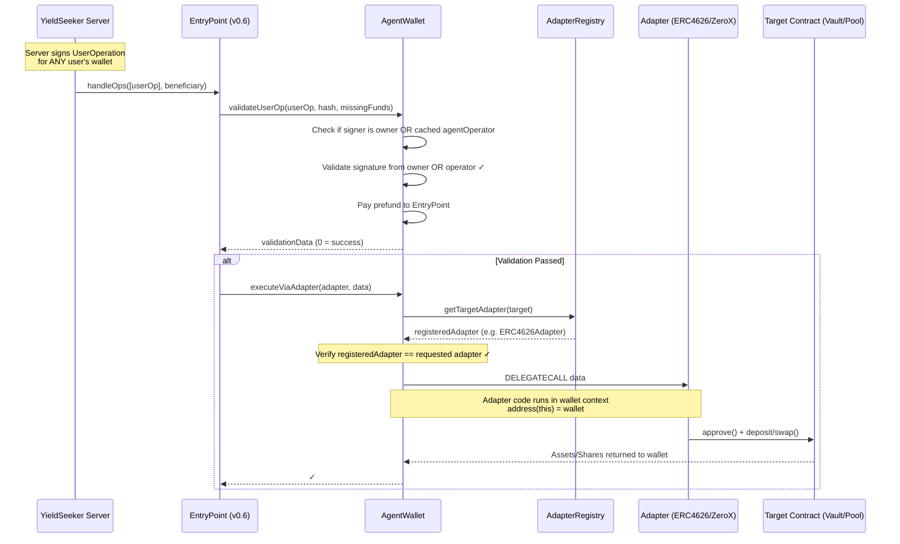
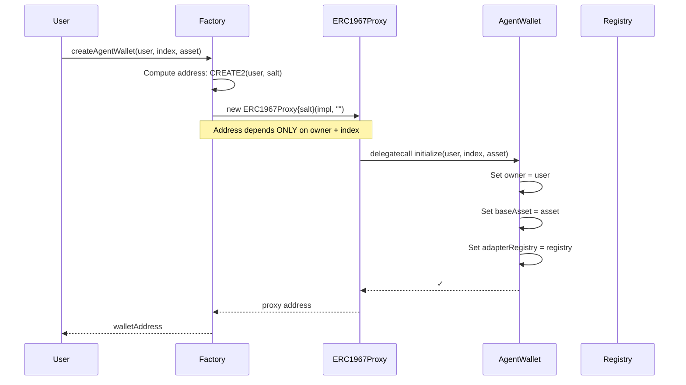
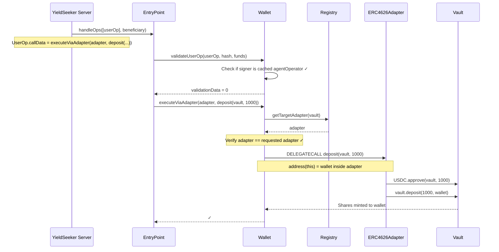
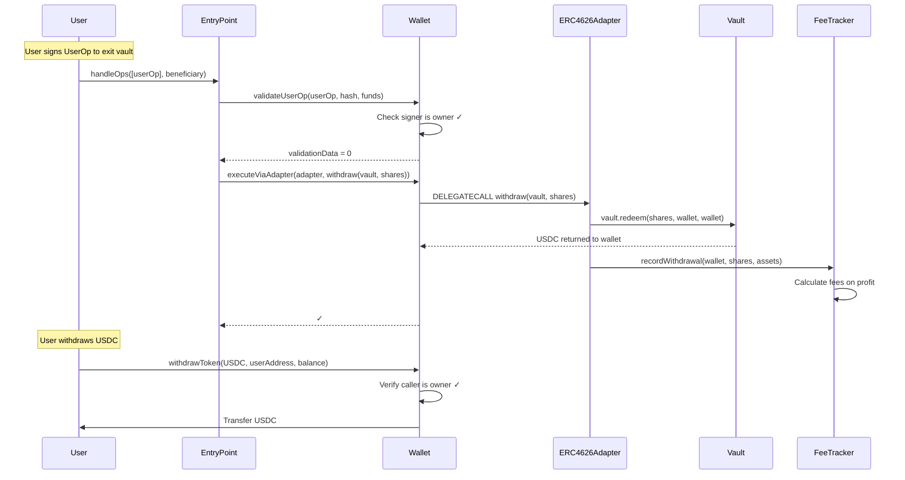
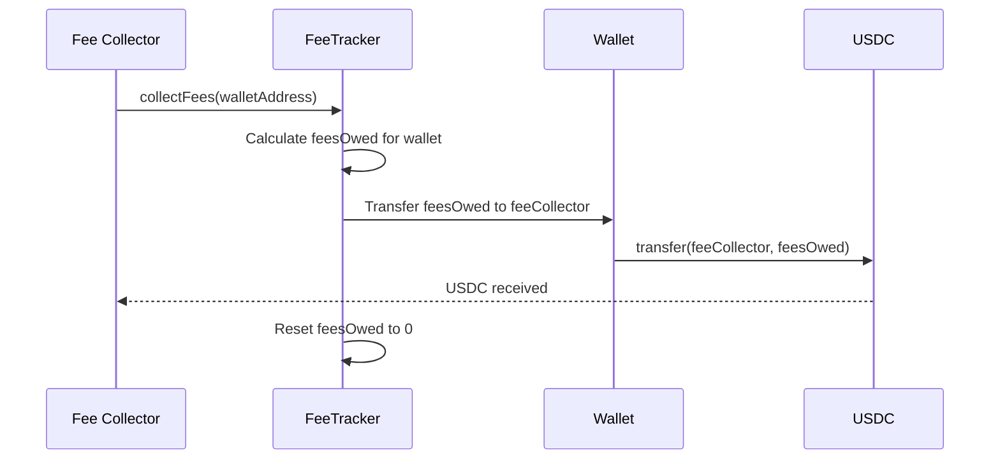
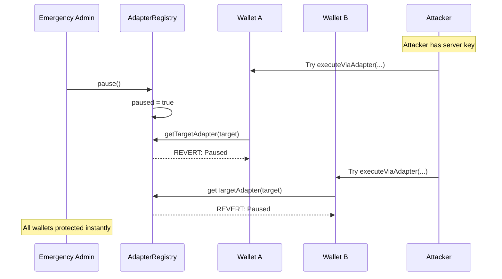

# YieldSeeker Contracts

## Overview

This is a **parameter-level validated smart wallet system** for autonomous agents. Unlike traditional smart wallets that only restrict which _functions_ can be called, this system validates the _parameters_ of each call and supports a centralized server that can manage multiple wallets without individual configuration.

### The Problem with Traditional Smart Wallets

Traditional smart wallets typically allow session keys with function selector restrictions:
- ✅ "Key X can call `swap()` on Uniswap"
- ❌ But they **cannot prevent**: `swap(USDC, attacker_wallet, 100%)`

If an operator key is compromised, an attacker can:
1. Call allowed functions with malicious parameters
2. Redirect funds to their own address
3. Drain the wallet completely

### Our Solution: Adapter-Based Execution with Onchain Proof

This system enforces **parameter-level validation** through protocol-specific adapters:

```
┌─────────────────────────────────────────────────────────────────────┐
│                         AgentWallet                                  │
│                                                                      │
│  ┌─────────────────────────────────────────────────────────────┐   │
│  │ executeViaAdapter(adapter, target, data)                     │   │
│  │                                                              │   │
│  │  1. Query AdapterRegistry: Is adapter registered?            │   │
│  │  2. Query AdapterRegistry: Is target mapped to this adapter? │   │
│  │  3. DELEGATECALL adapter.execute(target, data)               │   │
│  │     └─> Adapter validates ALL parameters in wallet context   │   │
│  └─────────────────────────────────────────────────────────────┘   │
│                                                                      │
│  ┌─────────────────────────────────────────────────────────────┐   │
│  │ execute(target, value, data) → DISABLED                      │   │
│  │  ❌ Cannot call arbitrary contracts                          │   │
│  └─────────────────────────────────────────────────────────────┘   │
└─────────────────────────────────────────────────────────────────────┘
```

**Key Security Properties:**
1. **Adapter Validation**: Every adapter function validates that outputs go to `address(this)` (the wallet)
2. **Target Whitelist**: Adapters can only interact with registered targets (vaults, pools, etc.)
3. **No Arbitrary Calls**: The `execute()` function is disabled - all operations must go through adapters
4. **Server Cannot Steal**: Even if the server is compromised, it can only call adapter functions that return assets to the wallet

### Emergency Controls and Stale Cache Mitigation

**Important Limitation**: Wallets cache `agentOperators` locally for ERC-4337 gas efficiency. This creates a window where:
- A removed operator can still sign for wallets that haven't called `syncFromFactory()`
- Mitigation: `AdapterRegistry.pause()` instantly blocks ALL adapter execution across ALL wallets

**Emergency Response Playbook:**
1. **Immediate**: Call `AdapterRegistry.pause()` - stops all agent operations instantly
2. **Then**: Remove compromised operator from Factory
3. **Finally**: Users call `syncFromFactory()` on their wallets (or we batch-call for them)

### Standards Compliance

| Standard | Purpose |
|----------|---------|
| **ERC-4337** | Account Abstraction - gas sponsorship, UserOperations |
| **UUPS** | Upgradeable Proxies - user-controlled wallet upgrades |
| **ERC-7201** | Namespaced Storage - safe upgrades without storage collisions |

---

## Deployment & Security Requirements

### Chain Compatibility
- **Target Chain**: Base (Chain ID: 8453)
- **EntryPoint**: `0x5FF137D4b0FDCD49DcA30c7CF57E578a026d2789` (ERC-4337 v0.6)

### Adapter Requirements
- **Immutability**: All registered adapters MUST be immutable. They should not have upgradeability patterns (like `UUPS` or `TransparentProxy`) unless the proxy admin is the same as the `AdapterRegistry` admin.
- **No Self-Destruct**: Adapters MUST NOT contain the `selfdestruct` opcode.
- **Validation**: Adapters MUST follow the "Peek and Verify" pattern, taking the `target` address as their first argument to allow the `AgentWallet` to validate the call against the `AdapterRegistry`.
- **Stateless Design**: Adapters are designed to be **stateless code libraries** that execute via `delegatecall`. They should NEVER hold funds (ETH or tokens). All assets remain in the AgentWallet during adapter execution.

### Adapter Fund Handling
Since adapters execute via `delegatecall` in the wallet's context:
- All `approve()` calls are made FROM the wallet
- All `deposit()` calls send funds FROM the wallet
- All shares/receipts are minted TO the wallet (`address(this)` inside adapter = wallet address)
- Adapters cannot redirect funds to other addresses

### Technical Stack
- **Solidity Version**: `0.8.28`
- **Framework**: Foundry
- **ERC-4337 Version**: v0.6

---

## Fee Model

The system uses a **cost-basis tracking model** to calculate platform fees on realized gains.

### How It Works

1. **On Deposit**: FeeTracker records the deposit amount as "cost basis" for the wallet
2. **On Withdrawal**: FeeTracker compares withdrawal value to cost basis
   - If profit: Fee = `profitAmount * feeRate / 10000`
   - If loss: No fee, cost basis adjusted for remaining position
3. **Fee Collection**: Platform can call `collectFees(wallet)` to transfer owed fees

### Key Properties
- **Loss Protection**: If a withdrawal results in a loss, the cost basis for remaining shares is adjusted, and no fees are accrued.
- **Transparency**: Users can query `feeTracker().getFeesOwed(wallet)` at any time to see their outstanding fee balance.
- **Non-Custodial**: Fees are only collected from the wallet's balance; the platform never has direct custody of user funds beyond the earned fees.

---

## Architecture Overview

### Execution Flow



### Key Architecture Points

1. **Single Server Key**: One server private key can sign UserOperations for ALL wallets
2. **No Per-Wallet Config**: Server is authorized via Factory role, not individual wallet settings
3. **Cached Auth**: Wallets cache `agentOperators` list from Factory for gas-efficient ERC-4337 validation
4. **Adapter Validation**: Every `executeViaAdapter` call verifies the adapter is registered for the target

### System Constants

| Constant | Value | Description |
|----------|-------|-------------|
| `ENTRY_POINT` | `0x5FF137D4b0FDCD49DcA30c7CF57E578a026d2789` | ERC-4337 v0.6 EntryPoint |
| `FEE_DENOMINATOR` | `10000` | Fee rate denominator (e.g., 1000 = 10%) |

---

## Contract Reference

### Core Contracts

#### AgentWallet (`src/AgentWallet.sol`)

The user's smart wallet that holds funds and executes validated operations.

**Inheritance Chain:**
```
BaseAccount (ERC-4337) → Initializable → UUPSUpgradeable
```

**Storage (ERC-7201 Namespaced):**
| Field | Type | Description |
|-------|------|-------------|
| `owner` | `address` | Wallet owner (can withdraw, upgrade) |
| `ownerAgentIndex` | `uint256` | Index of this agent for the owner |
| `baseAsset` | `IERC20` | The primary asset this agent manages (e.g. USDC) |
| `adapterRegistry` | `AdapterRegistry` | Cached reference to AdapterRegistry from Factory |
| `feeTracker` | `FeeTracker` | Cached reference to FeeTracker from Factory |
| `agentOperators` | `address[]` | Cached list of authorized operators from Factory |
| `isAgentOperator` | `mapping(address => bool)` | Fast lookup for operator status |
| `blockedAdapters` | `mapping(address => bool)` | User-level adapter blocklist |
| `blockedTargets` | `mapping(address => bool)` | User-level target blocklist |

**Events:**
```solidity
event SyncedFromFactory(address indexed adapterRegistry, address indexed feeTracker);
```

**Key Functions:**

| Function | Access | Description |
|----------|--------|-------------|
| `initialize(owner, index, asset)` | Factory only | Sets up wallet and syncs config from Factory |
| `executeViaAdapter(adapter, target, data)` | Executors | Execute via registered adapter (DELEGATECALL) |
| `executeViaAdapterBatch(adapters[], targets[], datas[])` | Executors | Execute multiple adapter calls in a batch |
| `validateUserOp(userOp, hash, funds)` | EntryPoint | ERC-4337 signature validation (owner OR operator) |
| `blockAdapter(adapter)` | Owner only | Block an adapter from being used by this wallet |
| `unblockAdapter(adapter)` | Owner only | Unblock a previously blocked adapter |
| `blockTarget(target)` | Owner only | Block a target from being used by this wallet |
| `unblockTarget(target)` | Owner only | Unblock a previously blocked target |
| `syncFromFactory()` | Anyone | Refresh cached config from Factory |
| `withdrawToken(token, to, amount)` | Owner only | Withdraw any ERC20 token |
| `withdrawETH(to, amount)` | Owner only | Withdraw ETH |
| `upgradeToAndCall(newImpl, data)` | Owner only | UUPS upgrade (validates against Factory) |

**Upgrade Restrictions:**
The wallet enforces that upgrades can only use implementations approved by the Factory:
- User calls `upgradeToAndCall(newImplementation, data)`
- Wallet checks: `factory.isApprovedImplementation(newImplementation)` must be true
- This prevents users from upgrading to malicious implementations
- Factory admin controls which implementations are approved

**User Exit Rights:**
Despite Factory-controlled upgrades, users maintain sovereignty:
- **Withdrawal**: Owner can always call `withdrawToken()` and `withdrawETH()` to exit completely
- **Block Adapters**: Owner can block any adapter/target they don't trust
- **Exit Right**: During the timelock period, owners can withdraw all funds if they reject the upgrade

This design ensures:
- Users maintain complete sovereignty over their wallets
- No third party can force upgrades (aligns with "verify, don't trust")
- Security through factory approval and timelock notice period
- Users can choose to upgrade, wait, or exit entirely

**Operator Authorization:**
The wallet validates UserOperation signatures from either:
1. The wallet's owner (user's EOA)
2. Any address in the cached `agentOperators` list (synced from Factory)

**Important**: The operator list is cached locally for gas efficiency. After operator changes at the Factory level, wallets must call `syncFromFactory()` to refresh their cache. See [Emergency Controls](#emergency-controls-and-stale-cache-mitigation) for details on this limitation and mitigations.

---

#### AgentWalletFactory (`src/AgentWalletFactory.sol`)

Deploys new agent wallets as ERC1967 proxies and manages global configuration.

**Roles:**
| Role | Description |
|------|-------------|
| `DEFAULT_ADMIN_ROLE` | Manages implementation, registry, and roles |
| `AGENT_OPERATOR_ROLE` | Authorized to create wallets and sign for agents |

**Key Functions:**

| Function | Access | Description |
|----------|--------|-------------|
| `createAgentWallet(owner, index, asset)` | Operator | Deploys new wallet via CREATE2 |
| `getAddress(owner, index)` | View | Predicts address before deployment |
| `setAgentWalletImplementation(newImpl)` | Admin | Updates implementation for NEW wallets |
| `setAdapterRegistry(newRegistry)` | Admin | Updates registry for NEW wallets |
| `setFeeTracker(newTracker)` | Admin | Updates fee tracker for NEW wallets |

**Features:**
- **Deterministic Addresses**: Same owner + index = same address across chains (Asset-agnostic)
- **User Sovereignty**: Factory cannot force-upgrade existing wallets
- **ERC-4337 Compatible**: Implements `IEntryPoint.getSenderAddress()` pattern

---

#### AdapterRegistry (`src/AdapterRegistry.sol`)

The central registry that manages authorized adapters and their targets.

**Roles:**
| Role | Description |
|------|-------------|
| `DEFAULT_ADMIN_ROLE` | Can register adapters and targets |
| `EMERGENCY_ROLE` | Can remove targets/adapters and pause instantly |

**Key Functions:**

| Function | Access | Description |
|----------|--------|-------------|
| `registerAdapter(adapter)` | Admin | Register a new adapter contract |
| `setTargetAdapter(target, adapter)` | Admin | Map a target (vault/pool) to its adapter |
| `removeTarget(target)` | Emergency | Remove target mapping instantly |
| `unregisterAdapter(adapter)` | Emergency | Disable adapter (mappings preserved for re-registration) |
| `pause()` / `unpause()` | Emergency / Admin | Emergency pause/unpause |
| `getTargetAdapter(target)` | View | Returns adapter for target (reverts if paused) |
| `getAllTargets()` | View | Returns list of all registered targets |

---

#### FeeTracker (`src/FeeTracker.sol`)

Tracks cost basis and calculates fees on realized gains.

**Key Functions:**

| Function | Access | Description |
|----------|--------|-------------|
| `recordDeposit(wallet, amount)` | Adapters only | Record deposit for cost basis |
| `recordWithdrawal(wallet, shares, assets)` | Adapters only | Calculate fees on withdrawal |
| `collectFees(wallet)` | Fee Collector | Transfer owed fees from wallet |
| `getFeesOwed(wallet)` | View | Query outstanding fees |

---

### Adapters (`src/adapters/`)

Adapters are stateless contracts that execute protocol interactions via DELEGATECALL. They inherit from adapter base classes to enforce security constraints and provide common functionality.

#### Base Classes

**YieldSeekerAdapter (`src/adapters/Adapter.sol`)**
Abstract base class for all adapters providing:
- `onlyDelegateCall` modifier to prevent direct calls
- Helper functions: `_agentWallet()`, `_baseAsset()`, `_feeTracker()`
- Base asset validation: `_requireBaseAsset(address)`

#### Concrete Adapters

#### ERC4626Adapter (`src/adapters/ERC4626Adapter.sol`)

For Yearn V3, MetaMorpho, Morpho Blue, and other ERC4626 vaults.

**Functions:**
- `deposit(vault, assetAmount)` - Deposit base asset into vault
- `depositPercentage(vault, percentageBps)` - Deposit percentage of wallet balance
- `withdraw(vault, shareAmount)` - Withdraw shares from vault

**Validation:**
- Enforces that the vault's underlying asset matches the wallet's `baseAsset`
- Calls FeeTracker to record deposits/withdrawals for fee calculation

---

#### ZeroXAdapter (`src/adapters/ZeroXAdapter.sol`)

For 0x Protocol swaps.

**Functions:**
- `swap(zeroXTarget, swapCalldata)` - Execute a 0x swap

**Validation:**
- Decodes swap calldata to verify `recipient` is the wallet
- Prevents swaps that would send tokens elsewhere

---

#### MerklAdapter (`src/adapters/MerklAdapter.sol`)

For claiming Merkl rewards.

**Functions:**
- `claim(distributor, users[], tokens[], amounts[], proofs[][])` - Claim rewards

**Validation:**
- Verifies all `users` in the claim are the wallet address
- Prevents claiming rewards to other addresses

---

#### AaveV3Adapter (`src/adapters/AaveV3Adapter.sol`)

For Aave V3 lending pools. Handles deposits/withdrawals to Aave pools where the underlying asset is supplied to earn yield via aTokens.

**Functions:**
- `deposit(pool, assetAmount)` - Supply base asset to Aave pool, receive aTokens
- `depositPercentage(pool, percentageBps)` - Deposit percentage of wallet balance
- `withdraw(pool, assetAmount)` - Withdraw underlying from Aave pool by burning aTokens

**Validation:**
- Enforces that the pool's underlying asset matches the wallet's `baseAsset`
- Calls FeeTracker to record deposits/withdrawals for fee calculation
- Uses aToken balance to track shares (1:1 rebasing with underlying + yield)

**Technical Notes:**
- Aave V3 uses rebasing aTokens where balance increases automatically with accrued yield
- The adapter queries the aToken address from the pool's reserve data
- Withdrawals burn aTokens and return the underlying asset plus accrued interest

---

#### CompoundV3Adapter (`src/adapters/CompoundV3Adapter.sol`)

For Compound V3 (Comet) markets. Handles deposits/withdrawals to Compound V3 markets where the base asset earns supply APY.

**Functions:**
- `deposit(comet, assetAmount)` - Supply base asset to Comet market
- `depositPercentage(comet, percentageBps)` - Deposit percentage of wallet balance
- `withdraw(comet, assetAmount)` - Withdraw assets from Comet market

**Validation:**
- Enforces that the Comet's base token matches the wallet's `baseAsset`
- Calls FeeTracker to record deposits/withdrawals for fee calculation
- Uses Comet balance as shares (rebasing model)

**Technical Notes:**
- Compound V3 uses a rebasing balance model where `balanceOf()` returns principal + accrued interest
- Unlike Compound V2, there are no cTokens; the Comet contract itself tracks balances
- The adapter uses the wallet's Comet balance change to determine shares received

---

#### CompoundV2Adapter (`src/adapters/CompoundV2Adapter.sol`)

For Compound V2 and its forks (Moonwell, Venus, etc.). Handles deposits/withdrawals via cToken/mToken mint and redeem operations.

**Functions:**
- `deposit(cToken, assetAmount)` - Mint cTokens by supplying underlying asset
- `depositPercentage(cToken, percentageBps)` - Deposit percentage of wallet balance
- `withdraw(cToken, assetAmount)` - Redeem underlying by burning cTokens

**Validation:**
- Enforces that the cToken's underlying matches the wallet's `baseAsset`
- Calls FeeTracker to record deposits/withdrawals for fee calculation
- Uses cToken balance to track shares

**Technical Notes:**
- Compound V2 uses an exchange rate model where cTokens appreciate over time
- `mint(amount)` supplies underlying and mints cTokens at the current exchange rate
- `redeemUnderlying(amount)` redeems a specific amount of underlying, burning the required cTokens
- Exchange rate = (totalCash + totalBorrows - reserves) / totalSupply
- Works with Moonwell (mTokens), Venus (vTokens), and other Compound V2 forks

---

## Security Model

### Actors

| Actor | Description |
|-------|-------------|
| **User** | EOA that owns a wallet. Can withdraw funds and upgrade their wallet. |
| **YieldSeeker Server** | Centralized backend service that can sign UserOperations for ANY wallet. |
| **Platform Admin** | Manages the AdapterRegistry and Factory. |
| **Emergency Admin** | Can instantly pause, remove adapters, or targets in case of compromise. |

---

### Permissions by Contract

#### AgentWallet

| Action | Owner | Server | Adapter | Anyone |
|--------|-------|--------|---------|--------|
| `executeViaAdapter()` | ✅ | ✅ | ❌ | ❌ |
| `withdrawToken()` | ✅ | ❌ | ❌ | ❌ |
| `withdrawETH()` | ✅ | ❌ | ❌ | ❌ |
| `upgradeToAndCall()` | ✅ | ❌ | ❌ | ❌ |
| `blockAdapter()` | ✅ | ❌ | ❌ | ❌ |
| `blockTarget()` | ✅ | ❌ | ❌ | ❌ |
| `syncFromFactory()` | ✅ | ✅ | ✅ | ✅ |
| `execute()` | ❌ (DISABLED) | ❌ (DISABLED) | ❌ | ❌ |
| Receive deposits | ✅ | ✅ | ✅ | ✅ |

---

#### AgentWalletFactory

| Action | Admin | Operator | Anyone |
|--------|-------|----------|--------|
| `createAgentWallet()` | ✅ | ✅ | ❌ |
| `setAgentWalletImplementation()` | ✅ | ❌ | ❌ |
| `setAdapterRegistry()` | ✅ | ❌ | ❌ |
| `setFeeTracker()` | ✅ | ❌ | ❌ |
| `grantRole()` | ✅ | ❌ | ❌ |
| `getAddress()` | ✅ | ✅ | ✅ |

---

#### AdapterRegistry

| Action | Admin | Emergency | Anyone |
|--------|-------|-----------|--------|
| `registerAdapter()` | ✅ | ❌ | ❌ |
| `setTargetAdapter()` | ✅ | ❌ | ❌ |
| `removeTarget()` | ✅ | ✅ | ❌ |
| `unregisterAdapter()` | ✅ | ✅ | ❌ |
| `pause()` | ❌ | ✅ | ❌ |
| `unpause()` | ✅ | ❌ | ❌ |
| `getTargetAdapter()` | ✅ | ✅ | ✅ |

---

### Attack Scenarios

#### Scenario 1: Server Key Compromised

**Attack Vector**: Attacker obtains the YieldSeeker server private key.

**What Attacker CAN Do:**
- Sign UserOperations for any wallet
- Call `executeViaAdapter()` with registered adapters
- Deposit funds into registered vaults
- Swap tokens via registered 0x targets

**What Attacker CANNOT Do:**
- ❌ Transfer tokens directly (no `execute()`)
- ❌ Call unregistered adapters
- ❌ Interact with unregistered targets
- ❌ Withdraw to external addresses (adapters validate `recipient == wallet`)
- ❌ Upgrade wallets (owner only)

**Mitigation:**
1. Emergency admin calls `AdapterRegistry.pause()` - instantly stops all operations
2. Admin removes compromised operator from Factory
3. Users call `syncFromFactory()` to refresh their wallet's operator cache

---

#### Scenario 2: Malicious Adapter Registered

**Attack Vector**: Admin accidentally registers a malicious adapter that drains funds.

**Protection Layers:**
1. **Timelock**: Admin operations go through `AdminTimelock` with delay
2. **User Blocklist**: Users can call `blockAdapter(maliciousAdapter)` on their wallet
3. **Emergency Removal**: Emergency admin can instantly `unregisterAdapter()`

---

#### Scenario 3: User Wants to Exit

**User Rights:**
- Call `withdrawToken(USDC, userAddress, balance)` - always works
- Call `withdrawETH(userAddress, balance)` - always works
- No approval from server or platform needed
- User maintains complete sovereignty

---

## Example Flows

### Flow 1: Agent Wallet Creation

**Actors:**
- User (EOA that will own the wallet)
- Anyone (can call factory)

**Pre-requisites:**
- Factory deployed with implementation

**Sequence:**



**Result:**
- New wallet deployed at deterministic address (Asset-agnostic)
- User is owner (can withdraw, upgrade)
- Wallet ready to receive deposits
- Server can sign UserOperations for this wallet (no configuration needed)

**Code Example:**
```solidity
// Anyone with AGENT_OPERATOR_ROLE can create wallet for user
address walletAddr = factory.createAgentWallet(
    userAddress,     // Owner
    0,               // Index
    usdcAddress      // Base Asset
);

// User can now deposit USDC
IERC20(USDC).transfer(walletAddr, 1000e6);

// Server can immediately manage this wallet (no setup needed)
```

---

### Flow 2: User Deposits USDC, Server Manages Vault Positions

**Actors:**
- User (EOA that owns the wallet)
- YieldSeeker Server (signs UserOperations)

**Pre-requisites:**
- Agent wallet already created for user
- ERC4626Adapter registered in AdapterRegistry
- Target vault registered in AdapterRegistry (mapped to ERC4626Adapter)
- Server address set as `agentOperator` in Factory

**Step 1: User deposits USDC to their wallet**
```solidity
// User sends 1000 USDC to their agent wallet
IERC20(USDC).transfer(walletAddress, 1000e6);
```

**Step 2: Server deposits USDC into ERC4626 vault**



**Security Properties:**
- Server cannot transfer tokens directly out of wallet
- User retains full control and can withdraw at any time
- Single server key manages all wallets (no per-wallet configuration)

---

### Flow 3: User Withdraws Funds

**Actors:**
- User (EOA that owns the wallet)

**Pre-requisites:**
- User has funds in wallet (either USDC or vault shares)

**Option A: Direct Token Withdrawal**
```solidity
// User withdraws USDC directly from wallet
AgentWallet(walletAddress).withdrawToken(
    USDC,           // token
    userAddress,    // to
    1000e6          // amount
);
```

**Option B: Exit Vault Position First, Then Withdraw**



**Security Properties:**
- Only the owner can call `withdrawToken()` and `withdrawETH()`
- No server or platform approval needed
- User can exit at any time regardless of server status

---

### Flow 4: Fee Collection

**Actors:**
- Platform Fee Collector
- User's Wallet

**Pre-requisites:**
- User has realized profits from vault withdrawals
- FeeTracker has recorded fees owed

**Sequence:**



**Code Example:**
```solidity
// Check fees owed
uint256 feesOwed = feeTracker.getFeesOwed(walletAddress);

// Collect fees (only fee collector can call)
if (feesOwed > 0) {
    feeTracker.collectFees(walletAddress);
}
```

**Fee Calculation:**
- Fee is only charged on realized profits
- If user deposits 1000 USDC and withdraws 1100 USDC worth of shares:
  - Profit = 100 USDC
  - Fee (at 10% rate) = 10 USDC

---

### Flow 5: Emergency Pause

**Actors:**
- Emergency Admin
- All Wallets

**Trigger:** Server key compromise detected

**Sequence:**



**Key Properties:**
- Single `pause()` call protects ALL wallets
- No need to update individual wallets
- Users can still withdraw directly via `withdrawToken()` / `withdrawETH()`

---

## Deployment

### Setup

Required environment variables:
- `DEPLOYER_PRIVATE_KEY`: Private key for deployment transactions
- `SERVER_ADDRESS`: Backend server address
- `RPC_NODE_URL_8453`: Base network RPC endpoint
- `ETHERSCAN_API_KEY`:  For contract verification (optional)

Notes:
- `Deploy.s.sol` currently has swap router/factory addresses hardcoded for Base mainnet (`chainId == 8453`)
- `Deploy.s.sol` is selective and only deploys contracts with missing/zero addresses in `deployments.json`


### Deploy

```bash
forge script script/Deploy.s.sol:DeployScript --rpc-url $RPC_NODE_URL_8453 --broadcast --verify
```

Deployment addresses saved to `deployments.json`.


### Post-Deployment

```bash
# Register ERC4626 vaults
forge script script/RegisterVault.s.sol:RegisterVaultScript --rpc-url $RPC_NODE_URL_8453 --broadcast --sig "run(address,string)" <VAULT_ADDRESS> erc4626

# Register other vaults
forge script script/RegisterVault.s.sol:RegisterVaultScript --rpc-url $RPC_NODE_URL_8453 --broadcast --sig "run(address,string)" 0x4e65fE4DbA92790696d040ac24Aa414708F5c0AB aave
forge script script/RegisterVault.s.sol:RegisterVaultScript --rpc-url $RPC_NODE_URL_8453 --broadcast --sig "run(address,string)" 0xb125E6687d4313864e53df431d5425969c15Eb2F compound
forge script script/RegisterVault.s.sol:RegisterVaultScript --rpc-url $RPC_NODE_URL_8453 --broadcast --sig "run(address,string)" 0xEdc817A28E8B93B03976FBd4a3dDBc9f7D176c22 moonwell

# Rgister UniswapV3 router
forge script script/RegisterVault.s.sol:RegisterVaultScript --rpc-url $RPC_NODE_URL_8453 --broadcast --sig "run(address,string)" 0x2626664c2603336E57B271c5C0b26F421741e481 uniswapv3
# Rgister AerodromeV2 router
forge script script/RegisterVault.s.sol:RegisterVaultScript --rpc-url $RPC_NODE_URL_8453 --broadcast --sig "run(address,string)" 0xcF77a3Ba9A5CA399B7c97c74d54e5b1Beb874E43 aerodromev2
# Rgister AerodromeCL router
forge script script/RegisterVault.s.sol:RegisterVaultScript --rpc-url $RPC_NODE_URL_8453 --broadcast --sig "run(address,string)" 0xBE6D8f0d05cC4be24d5167a3eF062215bE6D18a5 aerodromecl
# Register Merkl
forge script script/RegisterVault.s.sol:RegisterVaultScript --rpc-url $RPC_NODE_URL_8453 --broadcast --sig "run(address,string)" 0x3Ef3D8bA38EBe18DB133cEc108f4D14CE00Dd9Ae merkl

# Add sellable tokens to the swap sell policy (tokens that agents are allowed to swap)
forge script script/AddSellableTokens.s.sol:AddSellableTokensScript --rpc-url $RPC_NODE_URL_8453 --broadcast --sig "run(address[])" "[<token_1>, <token_2>, ...]"
```

(temp) test with:
```bash
py scripts/agent_wallet_create_from_factory.py -u krishan-test -i 1

export WALLET=<output from above>

py scripts/agent_wallet_vault_deposit_withdraw.py -w $WALLET -v 0xE74c499fA461AF1844fCa84204490877787cED56 -m direct
py scripts/agent_wallet_vault_deposit_withdraw.py -w $WALLET -v 0xE74c499fA461AF1844fCa84204490877787cED56 -m paymaster

py scripts/agent_wallet_swap.py -w $WALLET -t 0xEeeeeEeeeEeEeeEeEeEeeEEEeeeeEeeeeeeeEEeE -m direct
py scripts/agent_wallet_swap.py -w $WALLET -t 0x4200000000000000000000000000000000000006 -m paymaster

py scripts/agent_wallet_merkl_claim.py -w $WALLET -m paymaster
```

### Selective Redeployment

To redeploy specific contracts:
1. Set the contract's address to `0x0000000000000000000000000000000000000000` in `deployments.json`
2. Run the deploy script again

---

## Development

### Requirements
- Foundry

### Running Tests
```bash
forge test -vvv
```

### Test Coverage

We have comprehensive tests in `test/`:

| Test File | Description |
|-----------|-------------|
| `Integration.t.sol` | Full lifecycle tests (create wallet, deposit, withdraw) |

**Key Tests:**
- ✅ Happy path: Create wallet, deposit to vault, withdraw
- ✅ Security: Cannot execute via unregistered adapter
- ✅ Security: Cannot call `execute()` directly (disabled)
- ✅ Server auth: Server can sign UserOperations for any wallet
- ✅ Server auth: Cannot execute with invalid server signature
- ✅ Server auth: Owner can still sign their own UserOperations

---

## Upgrade Guide

### Upgrading a Wallet

1. **Admin approves new implementation** in Factory
2. **User initiates upgrade**:
   ```solidity
   wallet.upgradeToAndCall(newImplementation, "");
   ```
3. **Wallet validates** that `factory.isApprovedImplementation(newImpl)` is true
4. **Upgrade executes** via UUPS pattern

### Upgrading Factory Configuration

1. Admin calls `factory.setAdapterRegistry(newRegistry)` or `factory.setFeeTracker(newTracker)`
2. This affects **NEW wallets only**
3. Existing wallets must call `syncFromFactory()` to get updated references

---

### FeeTracker Migration Guide

**IMPORTANT**: FeeTracker stores per-wallet fee accounting state. Changing the FeeTracker requires careful migration to prevent fee loss.

#### The Problem

When `factory.setFeeTracker(newTracker)` is called and wallets subsequently call `syncFromFactory()`:
- The wallet's `feeTracker` reference switches to the new contract
- All historical fee data remains **orphaned** in the old FeeTracker:
  - `agentFeesCharged[wallet]` - total fees charged
  - `agentFeesPaid[wallet]` - total fees paid
  - `agentVaultCostBasis[wallet][vault]` - cost basis for profit calculations
  - `agentVaultShares[wallet][vault]` - tracked vault shares
  - `agentYieldTokenFeesOwed[wallet][token]` - pending yield token fees
- New FeeTracker has **zero state** for existing wallets
- `newTracker.getFeesOwed(wallet)` returns **0** instead of the actual debt
- Users could withdraw all funds without paying accrued fees

```
┌─────────────────────────────────────────────────────────────────────┐
│  DANGEROUS: FeeTracker Switch Without Migration                      │
│                                                                      │
│  Day 1:  Wallet → FeeTrackerA (feesCharged: 1000 USDC)             │
│  Day 30: Admin sets Factory.feeTracker = FeeTrackerB                │
│  Day 31: Wallet.syncFromFactory() → points to FeeTrackerB           │
│          FeeTrackerB.getFeesOwed(wallet) = 0  ← FEES LOST!         │
│  Day 32: User withdraws all funds, platform never collects fees     │
└─────────────────────────────────────────────────────────────────────┘
```

#### Required Migration Pattern

The new FeeTracker should store a reference to the previous tracker and aggregate fee queries:

```solidity
contract YieldSeekerFeeTrackerV2 is AccessControl {
    // Reference to the previous FeeTracker for migration
    YieldSeekerFeeTracker public immutable LEGACY_TRACKER;

    // Track which wallets have been migrated
    mapping(address wallet => bool) public migrated;

    constructor(address admin, address legacyTracker) {
        _grantRole(DEFAULT_ADMIN_ROLE, admin);
        LEGACY_TRACKER = YieldSeekerFeeTracker(legacyTracker);
    }

    /**
     * @notice Get fees owed, checking both legacy and current tracker
     * @dev For unmigrated wallets, this returns the sum of:
     *      - Legacy tracker fees (historical debt)
     *      - Current tracker fees (new activity)
     */
    function getFeesOwed(address wallet) external view returns (uint256) {
        uint256 currentOwed = _getCurrentFeesOwed(wallet);

        // If not migrated, also include legacy fees
        if (!migrated[wallet] && address(LEGACY_TRACKER) != address(0)) {
            uint256 legacyOwed = LEGACY_TRACKER.getFeesOwed(wallet);
            return currentOwed + legacyOwed;
        }

        return currentOwed;
    }

    /**
     * @notice Migrate a wallet's fee state from legacy tracker
     * @dev Called once per wallet to snapshot legacy state into new tracker
     *      Can only be called by the wallet itself (msg.sender pattern)
     */
    function migrateFromLegacy() external {
        address wallet = msg.sender;
        require(!migrated[wallet], "Already migrated");
        require(address(LEGACY_TRACKER) != address(0), "No legacy tracker");

        // Copy fee accounting state
        (uint256 charged, uint256 paid, ) = LEGACY_TRACKER.getWalletStats(wallet);
        agentFeesCharged[wallet] = charged;
        agentFeesPaid[wallet] = paid;

        // Note: Vault positions (cost basis, shares) should also be migrated
        // if the new tracker needs to continue tracking existing positions

        migrated[wallet] = true;
        emit WalletMigrated(wallet, charged, paid);
    }
}
```

#### State That Must Be Migrated

| State Variable | Purpose | Migration Notes |
|----------------|---------|-----------------|
| `agentFeesCharged[wallet]` | Total fees charged to wallet | Direct copy |
| `agentFeesPaid[wallet]` | Total fees paid by wallet | Direct copy |
| `agentVaultCostBasis[wallet][vault]` | Cost basis for profit calculation | Requires knowing all vaults used by wallet |
| `agentVaultShares[wallet][vault]` | Tracked shares for profit calculation | Requires knowing all vaults used by wallet |
| `agentYieldTokenFeesOwed[wallet][token]` | Pending fees in yield tokens | Requires knowing all yield tokens received |

**Note**: For vault positions (`costBasis`, `shares`) and yield token fees, you need to either:
1. Track which vaults/tokens each wallet has interacted with (off-chain indexing)
2. Have wallets self-report their positions during migration
3. Accept that only `feesCharged` and `feesPaid` matter for fee enforcement (positions only affect future fee calculations)

#### Why This Matters

The FeeTracker is different from other factory configurations:
- `AdapterRegistry`: Stateless - new registry just needs same adapters registered
- `AgentOperators`: Cached locally but no critical accounting state
- `FeeTracker`: **Stateful** - contains critical per-wallet accounting data

Failing to migrate FeeTracker state allows users to avoid paying accrued platform fees, directly impacting revenue.

---

## Server Authorization Deep Dive

### How Server Signs for Any Wallet

```solidity
// In AgentWallet.validateUserOp():
function _validateSignature(PackedUserOperation calldata userOp, bytes32 userOpHash)
    internal view override returns (uint256)
{
    bytes32 hash = userOpHash.toEthSignedMessageHash();
    address recovered = hash.recover(userOp.signature);

    // Check if signer is owner
    if (recovered == l.owner) {
        return SIG_VALIDATION_SUCCESS;
    }

    // Check if signer is in cached agentOperators list
    if (l.isAgentOperator[recovered]) {
        return SIG_VALIDATION_SUCCESS;
    }

    return SIG_VALIDATION_FAILED;
}
```

### Key Points:
1. **No wallet-specific config**: Server doesn't need to be added to each wallet
2. **Cached for gas**: `isAgentOperator` mapping avoids external calls during validation
3. **Factory is source of truth**: `syncFromFactory()` refreshes the cache
4. **Instant revocation via pause**: Even with stale cache, pausing registry stops all operations

---

## Design Decisions

### Error Handling
Contracts use custom errors for:
- Gas-efficient reverts
- Clear error messages for debugging
- Consistent patterns across contracts

### EnumerableMap vs Simple Mapping Tradeoff
`AdapterRegistry` uses `EnumerableMap` for target→adapter mappings to enable `getAllTargets()` enumeration. Trade-off: Higher gas for writes, but essential for UI/monitoring.

### UUPS over Transparent Proxy
Chosen because:
- Lower deployment cost (no separate ProxyAdmin)
- Upgrade logic in implementation (user controls their wallet)
- Gas savings on every call (no admin slot check)

### ERC-7201 Namespaced Storage
Implementation contracts use ERC-7201 namespaced storage to:
- Prevent storage collisions during upgrades
- Enable safe addition of new storage variables
- Support multiple inheritance patterns
- Follow OpenZeppelin v5 best practices

### Caching vs Real-time Lookups
Wallets cache `agentOperators` and `adapterRegistry` references locally because:
- **ERC-4337 Gas Limits**: External calls during validation would exceed ~50k gas limit
- **Cost Efficiency**: Saves ~8k gas per operation (local SLOAD vs external CALL)
- **User Experience**: Enables sponsored transactions and lower fees
- **Trade-off**: Requires manual `syncFromFactory()` calls after config changes

### Adapter Base Classes
The inheritance hierarchy provides:
- `YieldSeekerAdapter`: Base class with `onlyDelegateCall` protection and helper functions
- `YieldSeekerVaultAdapter`: Abstract vault adapter with standard deposit/withdraw interface
- Concrete adapters: Protocol-specific implementations

This enables:
- Code reuse across similar protocols
- Standardized interfaces for rebalancing logic
- Consistent fee tracking patterns

---

## Gas Considerations

### Transaction Overhead

| Operation | Approximate Gas |
|-----------|-----------------|
| Wallet Creation | ~300k |
| ERC4626 Deposit | ~150k |
| ERC4626 Withdraw | ~180k |
| 0x Swap | ~200k (varies) |
| Merkl Claim | ~100k per token |

### Gas Optimization Strategies
1. **Batch Operations**: Use `executeViaAdapterBatch()` for multiple operations
2. **Paymaster**: Use ERC-4337 paymaster for gas sponsorship
3. **Off-peak Timing**: Execute during low gas periods

---

## Benefits

1. **Onchain Proof** - All operations verifiable on-chain via adapter validation
2. **Parameter Validation** - Adapters validate targets, not just function selectors
3. **Centralized Management** - Single server key manages all wallets
4. **Easy Key Rotation** - Update server address once, affects all wallets
5. **User Sovereignty** - Users can always withdraw and upgrade their wallets
6. **Gas Efficient** - ERC-4337 enables gas sponsorship
7. **Secure** - Strict validation prevents fund theft even if server is compromised
8. **Easier to Extend** - Just register new adapters/targets, no per-wallet updates needed
