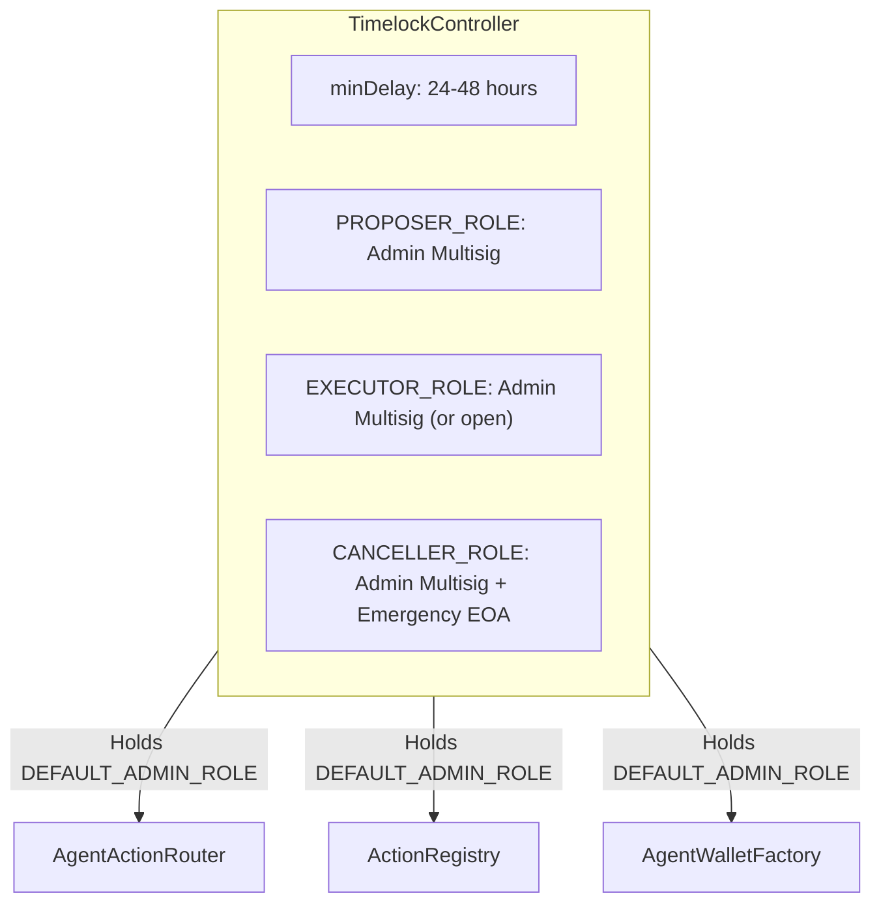
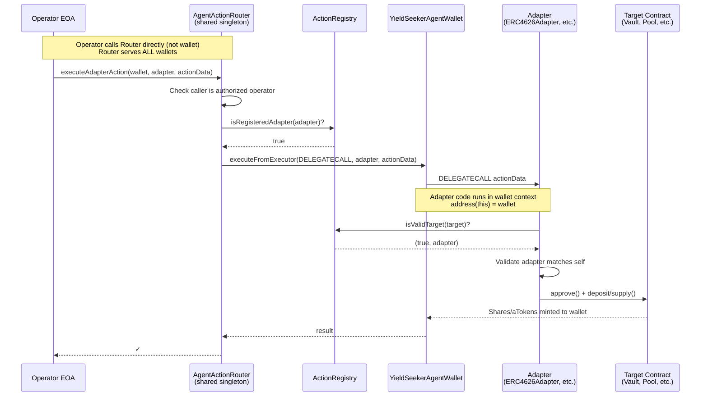
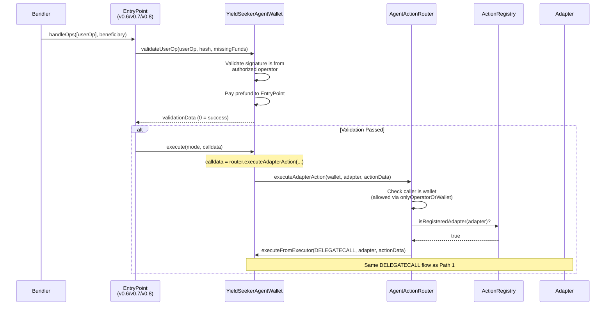
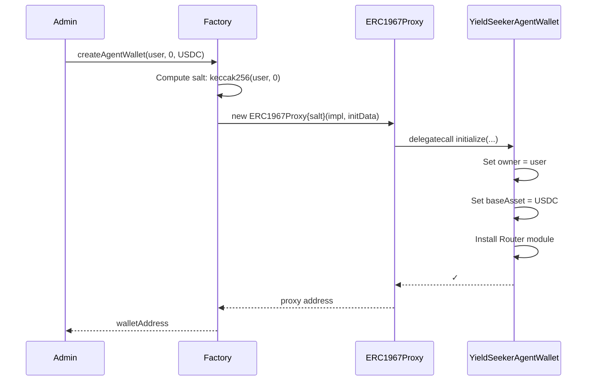
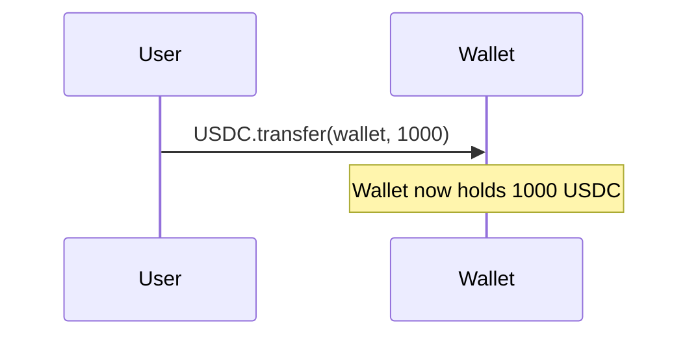
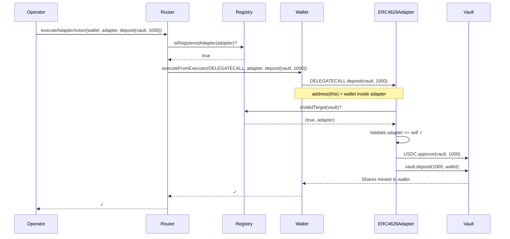
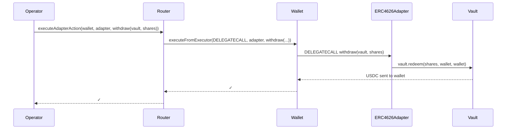

# Yield Seeker Smart Wallet System

## Overview

This is a **parameter-level validated smart wallet system** for autonomous agents. Unlike traditional smart wallets that only restrict which _functions_ can be called, this system validates the _parameters_ of each call to ensure security even when operators are compromised.

### The Problem with Traditional Smart Wallets

Consider an AI agent that autonomously moves USDC between yield vaults to maximize returns. To deposit into a vault, the agent needs to:

1. Call `USDC.approve(vault, amount)` - allow the vault to pull USDC
2. Call `vault.deposit(amount)` - trigger the deposit

Traditional smart wallets with operator permissions handle this by whitelisting functions:

```
Admin configures:
  ✓ Allow operator to call USDC.approve(spender, amount)
  ✓ Allow operator to call YearnVault.deposit(amount)
  ✓ Allow operator to call AavePool.supply(asset, amount, ...)
```

**The Problem**: The wallet allows `USDC.approve()` but cannot restrict the `spender` parameter. A malicious or compromised operator can:

```solidity
// Operator calls (perfectly "allowed" by traditional wallet):
USDC.approve(ATTACKER_CONTRACT, type(uint256).max);

// Attacker contract then drains all USDC:
USDC.transferFrom(wallet, attacker, USDC.balanceOf(wallet));
```

The wallet approved the call because `approve` was on the allowlist. It had no way to validate that the spender should only be a trusted vault.

### Our Solution: Adapter-Based Execution

Our system uses a layered validation approach with DELEGATECALL adapters:

**Two-Tier Validation:**
1. **Router validates adapter**: Only registered adapters can be called
2. **Adapter validates target**: Each adapter checks the target (vault, pool) is registered for that specific adapter

**Example Flow:**
- Operator calls: `router.executeAdapterAction(wallet, ERC4626Adapter, deposit(MorphoVault, 1000))`
- Router checks: `registry.isRegisteredAdapter(ERC4626Adapter)` ✓
- Router DELEGATECALLs adapter code into wallet context
- Adapter checks: `registry.isValidTarget(MorphoVault)` → returns `(true, ERC4626Adapter)` ✓
- Adapter executes: `approve()` + `deposit()` in wallet's context

**Why this works:**
- Operators can only call registered adapters
- Adapters can only operate on targets registered for them
- Solidity enforces function signatures - no arbitrary calldata
- Amounts are user-controlled (intentional)

### Standards Compliance

| Standard | Purpose |
|----------|---------|
| **ERC-4337** | Account Abstraction - gas sponsorship, UserOperations |
| **ERC-7579** | Modular Smart Accounts - pluggable executor/validator modules |
| **ERC-7201** | Namespaced Storage - safe upgrades without storage collisions |
| **UUPS** | Upgradeable Proxies - user-controlled wallet upgrades |

---

## Timelock Architecture

All administrative actions that could compromise user funds are protected by a **24-48 hour timelock**. This ensures that even if admin keys are compromised, there's time to detect and respond before damage occurs.

### TimelockController Setup

We use OpenZeppelin's `TimelockController` as the admin for all critical contracts:



### Timelocked vs Emergency Actions

| Contract | Timelocked (24h+) | Emergency (Instant) |
|----------|-------------------|---------------------|
| **AgentActionRouter** | `setRegistry()`, `addOperator()` | `removeOperator()` |
| **ActionRegistry** | `registerAdapter()`, `registerTarget()` | `removeTarget()`, `unregisterAdapter()` |
| **AgentWalletFactory** | `setImplementation()`, `setDefaultExecutor()` | — |

**Why this split?**
- **Adding** capabilities (operators, vaults, policies) → Must go through timelock
- **Removing** capabilities (for emergencies) → Instant response to threats

### Emergency Response Flow

If an operator key is compromised:
1. Emergency multisig calls `router.removeOperator(compromisedAddress)` immediately
2. Compromised operator can no longer execute any actions
3. Time to investigate and rotate keys without fund loss

---

## Architecture Overview

There are two entry paths into the system:

### Path 1: Direct Operator Call

The Router is a **shared singleton** - one Router serves all wallets. Operators call the Router directly, passing the target wallet address as a parameter.

**Key Architecture Points:**
- Router validates the adapter is registered in the ActionRegistry
- Router tells the wallet to DELEGATECALL the adapter
- Adapter code runs in the wallet's context (`address(this)` = wallet)
- Adapter validates the target (vault/pool) is registered for that adapter
- Adapter executes the actual protocol interaction



### Path 2: ERC-4337 UserOperation (Gas Sponsored)



---

## Contract Reference

### Core Contracts

#### YieldSeekerAgentWallet (`src/AgentWallet.sol`)

The user's smart wallet that holds funds and executes validated operations.

**Inheritance Chain:**


**Storage (ERC-7201 Namespaced):**
| Field | Type | Description |
|-------|------|-------------|
| `userAgentIndex` | `uint256` | Index for users with multiple agents |
| `baseAsset` | `address` | Primary asset (e.g., USDC) |
| `executorModule` | `address` | Reference to installed Router |

**Key Functions:**

| Function | Access | Description |
|----------|--------|-------------|
| `initialize(user, index, baseAsset, executor)` | Factory only | Sets up wallet with owner and auto-installs Router |
| `execute(mode, calldata)` | EntryPoint/Self | ERC-7579 execution (called after validation) |
| `executeFromExecutor(mode, calldata)` | Installed Executors | Module-triggered execution |
| `validateUserOp(userOp, hash, funds)` | EntryPoint | ERC-4337 signature validation (v0.6, v0.7, v0.8) |
| `installModule(type, module, data)` | Owner only | Add new ERC-7579 module |
| `uninstallModule(type, module, data)` | Owner only | Remove ERC-7579 module |
| `withdrawTokenToUser(token, recipient, amount)` | Owner only | User withdraws ERC20 |
| `withdrawEthToUser(recipient, amount)` | Owner only | User withdraws ETH |
| `upgradeToAndCall(newImpl, data)` | Owner only | Upgrade to new implementation |

**EntryPoint Compatibility:**
| Version | Address | UserOp Format |
|---------|---------|---------------|
| v0.6 | `0x5FF137D4b0FDCD49DcA30c7CF57E578a026d2789` | Unpacked `UserOperation` |
| v0.7 | `0x0000000071727De22E5E9d8BAf0edAc6f37da032` | Packed `PackedUserOperation` |
| v0.8 | `0x4337084D9E255Ff0702461CF8895CE9E3b5Ff108` | Packed `PackedUserOperation` |

---

#### AgentWalletFactory (`src/AgentWalletFactory.sol`)

Deploys new agent wallets as ERC1967 proxies with deterministic addresses.

**Key Functions:**

| Function | Access | Description |
|----------|--------|-------------|
| `createAgentWallet(user, index, baseAsset)` | AGENT_CREATOR_ROLE | Deploys new wallet via CREATE2 |
| `predictAgentWalletAddress(user, index, baseAsset)` | View | Predicts address before deployment |
| `setImplementation(newImpl)` | DEFAULT_ADMIN_ROLE | Updates implementation for new wallets |
| `setDefaultExecutor(executor)` | DEFAULT_ADMIN_ROLE | Sets Router to auto-install |

**Features:**
- **Deterministic Addresses**: Same user + index = same address across chains
- **Auto-Install Router**: New wallets have Router pre-installed
- **User Sovereignty**: Factory cannot force-upgrade existing wallets

---

### Modules (`src/modules/`)

#### AgentActionRouter (`src/modules/AgentActionRouter.sol`)

The ERC-7579 Executor Module that bridges operators to wallets via DELEGATECALL to adapters.

**Roles (AccessControl):**
| Role | Description |
|------|-------------|
| `DEFAULT_ADMIN_ROLE` | Can grant/revoke other roles (held by TimelockController) |
| `REGISTRY_ADMIN_ROLE` | Can update the ActionRegistry contract (timelocked) |
| `OPERATOR_ADMIN_ROLE` | Can add operators (timelocked) |
| `EMERGENCY_ROLE` | Can remove operators instantly |

**Key Functions:**

| Function | Access | Description |
|----------|--------|-------------|
| `executeAdapterAction(wallet, adapter, actionData)` | Operators or Wallet | Validates adapter, DELEGATECALLs to wallet |
| `executeAdapterActions(wallet, adapters[], actionDatas[])` | Operators or Wallet | Batch version for multiple actions |
| `addOperator(addr)` | OPERATOR_ADMIN_ROLE | Add authorized operator (timelocked) |
| `removeOperator(addr)` | EMERGENCY_ROLE | Remove operator instantly |
| `setRegistry(newRegistry)` | REGISTRY_ADMIN_ROLE | Update registry globally (timelocked) |

**Access Control:**
- `onlyOperatorOrWallet(wallet)`: Accepts calls from registered operators OR from the wallet itself (for ERC-4337 flow)

---

#### ActionRegistry (`src/ActionRegistry.sol`)

The central registry that maps external targets to their adapter contracts.

**Roles (AccessControl):**
| Role | Description |
|------|-------------|
| `DEFAULT_ADMIN_ROLE` | Can grant/revoke other roles (held by TimelockController) |
| `REGISTRY_ADMIN_ROLE` | Can register adapters and targets (timelocked) |
| `EMERGENCY_ROLE` | Can remove targets/adapters instantly |

**Storage:**
```solidity
mapping(address target => address adapter) public targetToAdapter;
mapping(address adapter => bool registered) public isRegisteredAdapter;
```

**Key Functions:**

| Function | Access | Description |
|----------|--------|-------------|
| `registerAdapter(adapter)` | REGISTRY_ADMIN_ROLE | Register a new adapter contract (timelocked) |
| `registerTarget(target, adapter)` | REGISTRY_ADMIN_ROLE | Map a target to its adapter (timelocked) |
| `updateTargetAdapter(target, newAdapter)` | REGISTRY_ADMIN_ROLE | Change adapter for existing target |
| `removeTarget(target)` | EMERGENCY_ROLE | Remove target instantly |
| `unregisterAdapter(adapter)` | EMERGENCY_ROLE | Unregister adapter instantly |
| `isValidTarget(target)` | View | Check if target is registered with valid adapter |
| `isRegisteredAdapter(adapter)` | View | Check if adapter is registered |

**Resolution Flow:**
1. Router calls `registry.isRegisteredAdapter(adapter)` → must be true
2. Adapter (during DELEGATECALL) calls `registry.isValidTarget(target)` → must return `(true, self)`

---

### Adapters (`src/adapters/`)

Adapters are stateless contracts that execute protocol interactions via DELEGATECALL. When called via DELEGATECALL from a wallet, `address(this)` equals the wallet address, allowing the adapter to execute operations in the wallet's context.

#### ERC4626Adapter (`src/adapters/ERC4626Adapter.sol`)

For Yearn V3, MetaMorpho, Morpho Blue, and other ERC4626 vaults.

**Key Functions:**

| Function | Context | Description |
|----------|---------|-------------|
| `deposit(vault, amount)` | DELEGATECALL | Approve vault, deposit assets, shares to wallet |
| `withdraw(vault, shares)` | DELEGATECALL | Redeem shares, assets to wallet |
| `getAsset(vault)` | View | Get underlying asset address |
| `getShareBalance(vault, wallet)` | View | Get share balance for wallet |

**Validation:**
- Checks `registry.isValidTarget(vault)` returns `(true, self)`
- Reverts with `VaultNotRegistered` or `WrongAdapter` if validation fails

---

#### AaveV3Adapter (`src/adapters/AaveV3Adapter.sol`)

For Aave V3 lending pools.

**Key Functions:**

| Function | Context | Description |
|----------|---------|-------------|
| `supply(pool, asset, amount)` | DELEGATECALL | Approve pool, supply asset, aTokens to wallet |
| `withdraw(pool, asset, amount)` | DELEGATECALL | Withdraw from pool, assets to wallet |
| `getATokenBalance(aToken, wallet)` | View | Get aToken balance for wallet |

**Validation:**
- Checks `registry.isValidTarget(pool)` returns `(true, self)`
- Reverts with `PoolNotRegistered` or `WrongAdapter` if validation fails

---

### Libraries (`src/lib/`)

#### ERC7579Account (`src/lib/ERC7579Account.sol`)

Base implementation for ERC-7579 modular accounts.

**Key Features:**
- Module registry (`_modules` mapping)
- Multi-EntryPoint support (v0.6, v0.7, v0.8)
- Execution primitives

---

#### AgentWalletStorage (`src/lib/AgentWalletStorage.sol`)

ERC-7201 namespaced storage for safe upgrades.

```solidity
library AgentWalletStorageV1 {
    bytes32 private constant STORAGE_LOCATION = keccak256("yieldseeker.agentwallet.v1");

    struct Layout {
        uint256 userAgentIndex;
        address baseAsset;
        address executorModule;
    }
}
```

**Upgrade Pattern:**
- V2 can append fields to V1 struct, OR
- V2 can create new `AgentWalletStorageV2` namespace

---

## Example Flows

### Flow 1: Agent Wallet Creation

**Actors:**
- Admin (has `AGENT_CREATOR_ROLE` on Factory)
- User (EOA that will own the wallet)

**Pre-requisites:**
- Factory deployed with implementation and default executor (Router)

**Sequence:**



**Result:**
- New wallet deployed at deterministic address
- User is owner (can withdraw, upgrade)
- Router is installed as executor module
- Wallet ready to receive deposits

**Code Example:**
```solidity
// Admin creates wallet for user
address walletAddr = factory.createAgentWallet(
    userAddress,     // Owner
    0,               // First agent for this user
    USDC_ADDRESS     // Base asset
);

// User can now deposit USDC
IERC20(USDC).transfer(walletAddr, 1000e6);

// Wallet is ready for operator actions
```

---

### Flow 2: User Deposits USDC, Operator Manages Vault Positions

**Actors:**
- User (EOA that owns the wallet)
- Operator (Backend service with operator role on Router)

**Pre-requisites:**
- Agent wallet already created for user
- Router has operator registered
- ERC4626Adapter registered in ActionRegistry
- Target vault registered in ActionRegistry (mapped to ERC4626Adapter)

**Sequence:**



**Step 1: User deposits USDC to their wallet**
```solidity
// User sends 1000 USDC to their agent wallet
IERC20(USDC).transfer(walletAddress, 1000e6);
```

**Step 2: Operator deposits USDC into ERC4626 vault**



```solidity
// Operator calls router to deposit user's USDC into ERC4626 vault
router.executeAdapterAction(
    walletAddress,
    address(erc4626Adapter),
    abi.encodeCall(ERC4626Adapter.deposit, (morphoVault, 1000e6))
);
// Wallet now holds vault shares instead of USDC
```

**Step 3: Operator withdraws from vault (e.g., moving to better yield)**



```solidity
// Operator withdraws shares from vault
uint256 shares = IERC20(morphoVault).balanceOf(walletAddress);

router.executeAdapterAction(
    walletAddress,
    address(erc4626Adapter),
    abi.encodeCall(ERC4626Adapter.withdraw, (morphoVault, shares))
);
// Wallet now holds USDC again (with any yield earned)
```

**Result:**
- User's USDC was deposited to Yearn vault
- Vault shares were held in the wallet (earning yield)
- Operator withdrew back to USDC
- User's wallet now contains original USDC + any yield earned
- At any point, user could call `withdrawTokenToUser()` to withdraw their funds

**Security Notes:**
- Operator can only interact with whitelisted vaults
- Operator cannot withdraw funds to arbitrary addresses
- Operator cannot transfer tokens directly out of wallet
- User retains full control and can withdraw at any time

---

## Security Model

### Actors

| Actor | Description |
|-------|-------------|
| **User** | EOA that owns a wallet. Can withdraw funds and upgrade their wallet. |
| **Operator** | Backend service that executes yield strategies on behalf of wallets. |
| **Platform Admin (Timelocked)** | Manages the Router and ActionRegistry via TimelockController (24h delay). |
| **Emergency Admin** | Can instantly remove operators, adapters, or targets in case of compromise. |
| **Factory Admin** | Can create wallets and update the default implementation. |

---

### Permissions by Contract

#### YieldSeekerAgentWallet

| Action | User (Owner) | Operator | Platform Admin | Anyone |
|--------|:------------:|:--------:|:--------------:|:------:|
| `withdrawTokenToUser()` | ✅ | ❌ | ❌ | ❌ |
| `withdrawEthToUser()` | ✅ | ❌ | ❌ | ❌ |
| `upgradeToAndCall()` | ✅ | ❌ | ❌ | ❌ |
| `installModule()` | ✅ | ❌ | ❌ | ❌ |
| `uninstallModule()` | ✅ | ❌ | ❌ | ❌ |
| `execute()` | via EntryPoint | via EntryPoint | ❌ | ❌ |
| `executeFromExecutor()` | ❌ | via Router | ❌ | ❌ |
| `validateUserOp()` | ❌ | ❌ | ❌ | EntryPoint only |
| Receive deposits | ✅ | ✅ | ✅ | ✅ |

---

#### YieldSeekerAgentWalletFactory

| Action | Role Required | Description |
|--------|---------------|-------------|
| `createAgentWallet()` | `AGENT_CREATOR_ROLE` | Deploy new wallet for a user |
| `setImplementation()` | `DEFAULT_ADMIN_ROLE` | Update implementation for NEW wallets |
| `setDefaultExecutor()` | `DEFAULT_ADMIN_ROLE` | Set Router to auto-install |
| `grantRole()` / `revokeRole()` | `DEFAULT_ADMIN_ROLE` | Manage access control |

---

#### AgentActionRouter

| Action | Role Required | Timing | Description |
|--------|---------------|--------|-------------|
| `executeAdapterAction()` | Operator OR Wallet | Instant | Execute adapter action via DELEGATECALL |
| `executeAdapterActions()` | Operator OR Wallet | Instant | Batch execute multiple adapter actions |
| `setRegistry()` | `REGISTRY_ADMIN_ROLE` | Timelocked (24h) | Update the ActionRegistry contract |
| `addOperator()` | `OPERATOR_ADMIN_ROLE` | Timelocked (24h) | Add backend operator |
| `removeOperator()` | `EMERGENCY_ROLE` | Instant | Remove operator immediately |
| `grantRole()` / `revokeRole()` | `DEFAULT_ADMIN_ROLE` | Timelocked (24h) | Manage access control |

---

#### ActionRegistry

| Action | Role Required | Timing | Description |
|--------|---------------|--------|-------------|
| `registerAdapter()` | `ADAPTER_ADMIN_ROLE` | Timelocked (24h) | Register a new adapter |
| `unregisterAdapter()` | `EMERGENCY_ROLE` | Instant | Remove adapter immediately |
| `registerTarget()` | `TARGET_ADMIN_ROLE` | Timelocked (24h) | Map target → adapter |
| `removeTarget()` | `EMERGENCY_ROLE` | Instant | Remove target mapping immediately |
| `isRegisteredAdapter()` | Anyone (view) | N/A | Check if adapter is registered |
| `isValidTarget()` | Anyone (view) | N/A | Check target and return its adapter |
| `grantRole()` / `revokeRole()` | `DEFAULT_ADMIN_ROLE` | Timelocked (24h) | Manage access control |

---

#### ERC4626Adapter / AaveV3Adapter

| Action | Caller | Description |
|--------|--------|-------------|
| `deposit()` | Wallet (via DELEGATECALL) | Deposit assets into vault/pool |
| `withdraw()` / `supply()` | Wallet (via DELEGATECALL) | Withdraw/supply assets |
| Internal validation | Adapter | Checks `registry.isValidTarget()` returns self |

Note: Adapters are stateless and executed via DELEGATECALL from the wallet. They don't have role-based access control—security comes from the Registry validating which targets each adapter can operate on.

---

### What Each Actor Can Achieve

#### User (Wallet Owner)
✅ **CAN:**
- Withdraw any token or ETH to any address
- Upgrade their wallet to any implementation
- Install/uninstall modules (add new capabilities)
- Transfer ownership to another address
- Receive funds from anyone

❌ **CANNOT:**
- Execute operator actions directly (must go through Router)
- Modify Router or ActionRegistry configurations
- Affect other users' wallets

---

#### Operator (Backend Service)
✅ **CAN:**
- Execute actions via registered adapters:
  - Deposit to registered vaults
  - Withdraw from registered vaults
  - Claim rewards (only to the wallet itself)
  - Swap tokens (output must be wallet's base asset)
- Sign UserOperations for gas-sponsored transactions

❌ **CANNOT:**
- Withdraw funds to arbitrary addresses
- Approve tokens to non-registered contracts
- Transfer tokens directly
- Upgrade wallet implementations
- Install/uninstall modules
- Call adapters or targets not registered in ActionRegistry

---

#### Platform Admin (via TimelockController)
✅ **CAN (with 24h delay):**
- Add operators
- Register new adapters
- Register new targets (vaults, pools)
- Swap the entire ActionRegistry contract
- Grant/revoke admin roles

❌ **CANNOT:**
- Access user funds directly
- Force-upgrade existing wallets
- Instantly add new operators or registrations (24h delay enforced)

---

#### Emergency Admin (EMERGENCY_ROLE)
✅ **CAN (instantly):**
- Remove operators
- Unregister adapters
- Remove target registrations

❌ **CANNOT:**
- Add new operators or registrations
- Access user funds
- Grant or revoke roles
- Execute actions on wallets
- Bypass adapter validation

---

#### Factory Admin
✅ **CAN:**
- Create new wallets for users
- Update default implementation (affects NEW wallets only)
- Change default executor module

❌ **CANNOT:**
- Upgrade existing wallets
- Access funds in any wallet
- Modify Router or ActionRegistry

---

## Deployment

Deployment is automated via Foundry scripts in `script/Deploy.s.sol`.

### Step 1: Deploy All Contracts

```bash
# Set environment variables
export DEPLOYER_PRIVATE_KEY=<your-private-key>
export PROPOSER_ADDRESS=<proposer-multisig>
export EXECUTOR_ADDRESS=<executor-multisig>
export AAVE_V3_POOL=<aave-v3-pool-address>

# Deploy
forge script script/Deploy.s.sol:DeployYieldSeeker --rpc-url <RPC_URL> --broadcast
```

This deploys:
- `YieldSeekerAdminTimelock` (24h delay)
- `ActionRegistry`
- `AgentActionRouter`
- `YieldSeekerAgentWallet` (implementation)
- `YieldSeekerAgentWalletFactory`
- `ERC4626Adapter`
- `AaveV3Adapter`

### Step 2: Schedule Configuration (via Timelock)

```bash
# Additional env vars from Step 1 output
export TIMELOCK_ADDRESS=<deployed-timelock>
export ROUTER_ADDRESS=<deployed-router>
export REGISTRY_ADDRESS=<deployed-registry>
export FACTORY_ADDRESS=<deployed-factory>
export ERC4626_ADAPTER=<deployed-erc4626-adapter>
export AAVE_ADAPTER=<deployed-aave-adapter>
export EMERGENCY_ADDRESS=<emergency-multisig>
export OPERATOR_ADDRESS=<backend-operator>
export USDC_ADDRESS=<usdc-token>
export AUSDC_ADDRESS=<ausdc-token>

# Optional
export YEARN_USDC_VAULT=<yearn-vault>
export METAMORPHO_USDC_VAULT=<metamorpho-vault>
export MERKL_DISTRIBUTOR=<merkl-distributor>
export ZEROEX_EXCHANGE=<zeroex-exchange>

# Schedule all operations
forge script script/Deploy.s.sol:ScheduleTimelockOperations --rpc-url <RPC_URL> --broadcast
```

### Step 3: Execute After 24h Delay

```bash
# After 24 hours have passed
forge script script/Deploy.s.sol:ExecuteTimelockOperations --rpc-url <RPC_URL> --broadcast
```

---

## Upgrade Guide

### Upgrading a Wallet (User Action)

```solidity
// User calls on their wallet
wallet.upgradeToAndCall(
    newImplementationAddress,
    abi.encodeCall(WalletV2.initializeV2, (newParam))
);
```

### Upgrading Registry (Admin Action via Timelock)

```solidity
// Deploy new registry
ActionRegistryV2 newRegistry = new ActionRegistryV2();

// Configure new registry...

// Schedule update (24h delay)
timelock.schedule(
    router,
    0,
    abi.encodeCall(router.setRegistry, (address(newRegistry))),
    bytes32(0),
    bytes32("updateRegistry"),
    24 hours
);

// After 24h, execute
timelock.execute(...);

// All wallets now use new registry
```

### Adding New Vault Support (via Timelock)

```solidity
// If using existing adapter (e.g., ERC4626Adapter for a new ERC4626 vault):
// Schedule target registration (24h delay)
timelock.schedule(
    registry,
    0,
    abi.encodeCall(registry.registerTarget, (newVaultAddress, erc4626AdapterAddress)),
    bytes32(0),
    bytes32("registerVault"),
    24 hours
);

// After 24h, execute
timelock.execute(...);

// If new adapter needed for different protocol:
// 1. Deploy new adapter
NewProtocolAdapter adapter = new NewProtocolAdapter(registry);

// 2. Schedule adapter registration
timelock.schedule(
    registry,
    0,
    abi.encodeCall(registry.registerAdapter, (address(adapter))),
    bytes32(0),
    bytes32("registerAdapter"),
    24 hours
);

// 3. Schedule target registrations pointing to new adapter
// ...
```

### Emergency: Removing Compromised Operator

```solidity
// Emergency multisig can act instantly
router.removeOperator(compromisedOperator);  // No delay!

// Compromised operator can no longer execute any actions
// Take time to investigate and rotate keys safely
```
