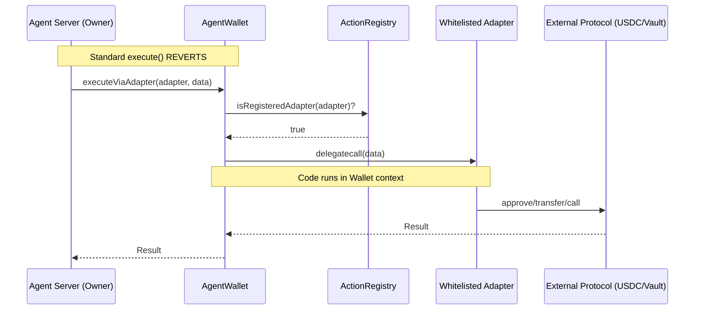

# Agent Wallet with Onchain Proof

## Overview

This project implements a secure smart wallet system for autonomous agents. The core goal is to provide **onchain proof** that the agent's funds strictly follow allowed rails.

Unlike standard smart wallets where the owner (server) has unrestricted control, this system **enforces that all interactions must go through whitelisted adapters**.

### The Core Security Promise

1.  **No Arbitrary Execution**: The standard `execute` and `executeBatch` functions are **disabled**. The server cannot sign a transaction to send funds to an arbitrary address.
2.  **Whitelisted Logic Only**: All actions must be performed via `executeViaAdapter`, which checks the `ActionRegistry` before delegatecalling an adapter.
3.  **Registry Control**: The `ActionRegistry` defines which adapters are allowed.

## Architecture

### Components

-   **AgentWallet**: The user's smart account.
    -   Inherits `SimpleAccount` (ERC-4337 compatible).
    -   **Overrides `execute` to revert (`NotAllowed`)**.
    -   Adds `executeViaAdapter(adapter, data)` which enforces the registry check.
-   **ActionRegistry**: A whitelist contract.
    -   Stores valid `adapter` addresses.
    -   Managed by a governance/admin role (Timelock compatible).
-   **Adapters**: Stateless contracts containing logic (e.g., `approve`, `deposit`).
    -   Executed via `delegatecall` in the wallet's context.

### Execution Flow



## Security Constraints

### 1. The "Bad Case" Protection
The server **CANNOT**:
-   Approve USDC to an unknown spender.
-   Transfer ETH/tokens to an arbitrary address.
-   Call a malicious contract.

**Why?**
The only entry point is `executeViaAdapter`. The `adapter` MUST be in the `ActionRegistry`. A malicious adapter cannot be called unless it was explicitly added to the registry by the admin.

### 2. Adapter Safety
Adapters are trusted code. They are responsible for:
-   Validating their own parameters (e.g., ensuring `target` vault is safe, if applicable).
-   Performing the exact logic defined (e.g., `VaultAdapter` only interacts with vaults).

## Integration Tests

We have verified the system using Foundry tests in `test/Integration.t.sol`:

| Test Name | Description |
|-----------|-------------|
| `test_HappyPath_DeFiLifecycle` | Verifies creating a wallet, approving a token via adapter, depositing to a vault, and withdrawing. |
| `test_Security_CannotExecuteViaUnregisteredAdapter` | Verifies that calling an unregistered adapter reverts. |
| **`test_Security_CannotExecuteDirectly`** | **CRITICAL**: Verifies that calling `execute()` directly (bypassing registry) reverts. |

## Development

### Requirements
-   Foundry

### Running Tests
```bash
forge test -vvv
```

## Integration Plan

### 1. Deployment Requirements
-   **Registry & Factory**: Deploy `ActionRegistry` and `AgentWalletFactory` to target chain (Base).
-   **Adapters**: Deploy core adapters (e.g. `ERC20TransferAdapter`, `AaveV3Adapter`, `UniswapAdapter`).
-   **Configuration**:
    -   Register adapters in `ActionRegistry`.
    -   Register valid targets (Token addresses, Vault addresses) in `ActionRegistry`.

### 2. Backend Migration (`api/`)
The current `wallet_manager.py` assumes unrestricted execution.

#### A. ABI Generation
-   Generate Python interfaces for `AgentWallet`, `AgentWalletFactory`, `ActionRegistry`.

#### B. Wallet Creation
-   Update `agent_wallet_delegate_coinbase.py` (or equivalent) to use `AgentWalletFactory.createAccount` for new users.

#### C. Execution Logic
-   **Current**: `wallet.execute(target, data)`
-   **New**:
    1.  Determine required adapter for `target` (Lookup in DB or Contract).
    2.  Construct `adapterData`.
    3.  Call `wallet.executeViaAdapter(adapter, adapterData)`.
-   **Safety Check**: Before sending, backend should verify `registry.isValidTarget(target)` to avoid reverts.
