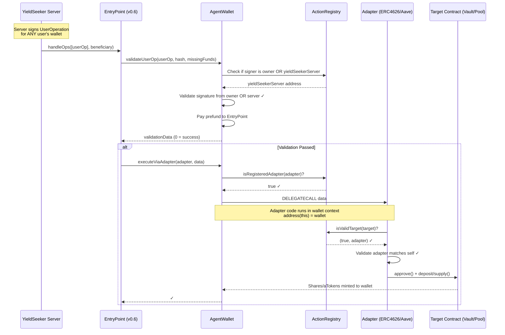
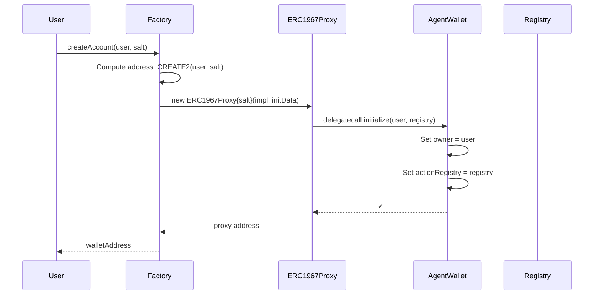
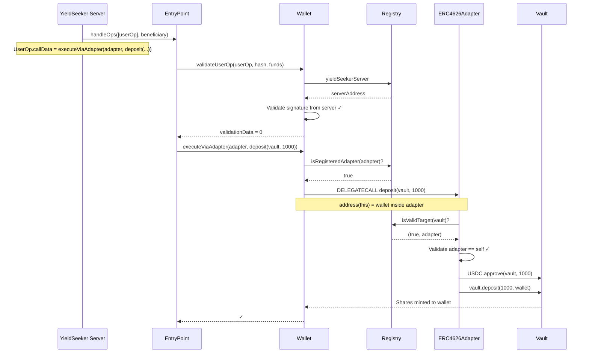

# YieldSeeker Agent Wallet System v4

## Overview

This is a **parameter-level validated smart wallet system** for autonomous agents with **centralized server authorization**. Unlike traditional smart wallets that only restrict which _functions_ can be called, this system validates the _parameters_ of each call and supports a centralized server that can manage multiple wallets without individual configuration.

### The Problem with Traditional Smart Wallets

Consider an AI agent that autonomously moves USDC between yield vaults to maximize returns. To deposit into a vault, the agent needs to:

1. Call `USDC.approve(vault, amount)` - allow the vault to pull USDC
2. Call `vault.deposit(amount)` - trigger the deposit

Traditional smart wallets with operator permissions handle this by whitelisting functions:

```
Admin configures:
  ✓ Allow operator to call USDC.approve(spender, amount)
  ✓ Allow operator to call YearnVault.deposit(amount)
  ✓ Allow operator to call AavePool.supply(asset, amount, ...)
```

**The Problem**: The wallet allows `USDC.approve()` but cannot restrict the `spender` parameter. A malicious or compromised operator can:

```solidity
// Operator calls (perfectly "allowed" by traditional wallet):
USDC.approve(ATTACKER_CONTRACT, type(uint256).max);

// Attacker contract then drains all USDC:
USDC.transferFrom(wallet, attacker, USDC.balanceOf(wallet));
```

The wallet approved the call because `approve` was on the allowlist. It had no way to validate that the spender should only be a trusted vault.

### Our Solution: Adapter-Based Execution with Onchain Proof

Our system uses a layered validation approach:

**Core Security Principles:**
1. **No Arbitrary Execution**: Standard `execute()` and `executeBatch()` functions are **disabled**
2. **Adapter Validation**: All actions must go through `executeViaAdapter()` which validates the adapter is registered
3. **Target Validation**: Adapters validate that targets (vaults, pools) are registered for that specific adapter
4. **Server Authorization**: A centralized `yieldSeekerServer` can sign UserOperations for any wallet, enabling easy key rotation

**Example Flow:**
- Server signs UserOperation: `wallet.executeViaAdapter(ERC4626Adapter, deposit(MorphoVault, 1000))`
- Wallet validates signature is from owner OR yieldSeekerServer
- Wallet checks: `registry.isRegisteredAdapter(ERC4626Adapter)` ✓
- Wallet DELEGATECALLs adapter code into wallet context
- Adapter checks: `registry.isValidTarget(MorphoVault)` → returns `(true, ERC4626Adapter)` ✓
- Adapter executes: `approve()` + `deposit()` in wallet's context

**Why this works:**
- Server can only call registered adapters
- Adapters can only operate on targets registered for them
- Solidity enforces function signatures - no arbitrary calldata
- Amounts are user-controlled (intentional)
- Single server key can manage all wallets without individual configuration

### Standards Compliance

| Standard | Purpose |
|----------|---------|
| **ERC-4337** | Account Abstraction - gas sponsorship, UserOperations |
| **UUPS** | Upgradeable Proxies - user-controlled wallet upgrades |
| **ERC-7201** | Namespaced Storage - safe upgrades without storage collisions |

---

## Architecture Overview

### Execution Flow



### Key Architecture Points

- **Disabled Standard Execution**: `execute()` and `executeBatch()` revert with `NotAllowed`
- **Adapter-Only Execution**: All operations must go through `executeViaAdapter()`
- **Registry Validation**: Adapters must be registered, targets must be registered for that adapter
- **DELEGATECALL Context**: Adapter code runs in wallet's context (`address(this)` = wallet)
- **Server Authorization**: Registry stores `yieldSeekerServer` address that can sign for any wallet
- **ERC-4337 Compatible**: Full support for UserOperations and gas sponsorship

---

## Contract Reference

### Core Contracts

#### AgentWallet (`src/AgentWallet.sol`)

The user's smart wallet that holds funds and executes validated operations.

**Inheritance Chain:**
```
BaseAccount (ERC-4337) → Initializable → UUPSUpgradeable
```

**Storage (ERC-7201 Namespaced):**
| Field | Type | Description |
|-------|------|-------------|
| `owner` | `address` | Wallet owner (can withdraw, upgrade) |
| `actionRegistry` | `address` | Reference to ActionRegistry |

**Key Functions:**

| Function | Access | Description |
|----------|--------|-------------|
| `initialize(owner, registry)` | Factory only | Sets up wallet with owner and registry |
| `executeViaAdapter(adapter, data)` | EntryPoint/Owner | Execute via registered adapter (DELEGATECALL) |
| `validateUserOp(userOp, hash, funds)` | EntryPoint | ERC-4337 signature validation (owner OR server) |
| `withdrawTokenToUser(token, recipient, amount)` | Owner only | User withdraws ERC20 |
| `withdrawAllToUser(recipient)` | Owner only | User withdraws all base asset |
| `withdrawEthToUser(recipient, amount)` | Owner only | User withdraws ETH |
| `upgradeToAndCall(newImpl, data)` | Owner only | Upgrade to approved implementation |
| `execute()` | **DISABLED** | Reverts with `NotAllowed` |
| `executeBatch()` | **DISABLED** | Reverts with `NotAllowed` |

**Server Authorization:**
The wallet validates UserOperation signatures from either:
1. The wallet's owner (user's EOA)
2. The `yieldSeekerServer` address from the ActionRegistry

This allows a single server to manage all wallets without per-wallet configuration.

---

#### AgentWalletFactory (`src/AgentWalletFactory.sol`)

Deploys new agent wallets as ERC1967 proxies with deterministic addresses.

**Key Functions:**

| Function | Access | Description |
|----------|--------|-------------|
| `createAccount(owner, salt)` | Anyone | Deploys new wallet via CREATE2 |
| `getAddress(owner, salt)` | View | Predicts address before deployment |
| `setImplementation(newImpl)` | Owner only | Updates implementation for new wallets |

**Features:**
- **Deterministic Addresses**: Same owner + salt = same address across chains
- **User Sovereignty**: Factory cannot force-upgrade existing wallets
- **ERC-4337 Compatible**: Implements `IEntryPoint.getSenderAddress()` pattern

---

#### ActionRegistry (`src/ActionRegistry.sol`)

The central registry that manages adapters, targets, and server authorization.

**Roles (AccessControl):**
| Role | Description |
|------|-------------|
| `DEFAULT_ADMIN_ROLE` | Can grant/revoke other roles |
| `REGISTRY_ADMIN_ROLE` | Can register adapters, targets, and set server |
| `EMERGENCY_ROLE` | Can remove targets/adapters and pause instantly |

**Storage:**
```solidity
mapping(address target => address adapter) public targetToAdapter;
mapping(address adapter => bool registered) public isRegisteredAdapter;
address public yieldSeekerServer;  // Centralized server authorization
bool public paused;
```

**Key Functions:**

| Function | Access | Description |
|----------|--------|-------------|
| `registerAdapter(adapter)` | REGISTRY_ADMIN_ROLE | Register a new adapter contract |
| `registerTarget(target, adapter)` | REGISTRY_ADMIN_ROLE | Map a target to its adapter |
| `updateTargetAdapter(target, newAdapter)` | REGISTRY_ADMIN_ROLE | Change adapter for existing target |
| `removeTarget(target)` | EMERGENCY_ROLE | Remove target instantly |
| `unregisterAdapter(adapter)` | EMERGENCY_ROLE | Unregister adapter instantly |
| `setYieldSeekerServer(server)` | REGISTRY_ADMIN_ROLE | Set centralized server address |
| `pause()` / `unpause()` | EMERGENCY_ROLE / REGISTRY_ADMIN_ROLE | Emergency pause/unpause |
| `isValidTarget(target)` | View | Check if target is registered with valid adapter |
| `isRegisteredAdapter(adapter)` | View | Check if adapter is registered |

**Resolution Flow:**
1. Wallet calls `registry.isRegisteredAdapter(adapter)` → must be true
2. Adapter (during DELEGATECALL) calls `registry.isValidTarget(target)` → must return `(true, self)`

---

### Adapters (`src/adapters/`)

Adapters are stateless contracts that execute protocol interactions via DELEGATECALL. When called via DELEGATECALL from a wallet, `address(this)` equals the wallet address, allowing the adapter to execute operations in the wallet's context.

#### ERC4626Adapter (`src/adapters/ERC4626Adapter.sol`)

For Yearn V3, MetaMorpho, Morpho Blue, and other ERC4626 vaults.

**Key Functions:**

| Function | Context | Description |
|----------|---------|-------------|
| `deposit(vault, amount)` | DELEGATECALL | Approve vault, deposit assets, shares to wallet |
| `withdraw(vault, shares)` | DELEGATECALL | Redeem shares, assets to wallet |
| `getAsset(vault)` | View | Get underlying asset address |
| `getShareBalance(vault, wallet)` | View | Get share balance for wallet |

**Validation:**
- Checks `registry.isValidTarget(vault)` returns `(true, self)`
- Reverts with `VaultNotRegistered` or `WrongAdapter` if validation fails

---

#### AaveV3Adapter (`src/adapters/AaveV3Adapter.sol`)

For Aave V3 lending pools.

**Key Functions:**

| Function | Context | Description |
|----------|---------|-------------|
| `supply(pool, asset, amount)` | DELEGATECALL | Approve pool, supply asset, aTokens to wallet |
| `withdraw(pool, asset, amount)` | DELEGATECALL | Withdraw from pool, assets to wallet |
| `getATokenBalance(aToken, wallet)` | View | Get aToken balance for wallet |

**Validation:**
- Checks `registry.isValidTarget(pool)` returns `(true, self)`
- Reverts with `PoolNotRegistered` or `WrongAdapter` if validation fails

---

## Security Model

### Actors

| Actor | Description |
|-------|-------------|
| **User** | EOA that owns a wallet. Can withdraw funds and upgrade their wallet. |
| **YieldSeeker Server** | Centralized backend service that can sign UserOperations for ANY wallet. |
| **Platform Admin** | Manages the ActionRegistry and Factory. |
| **Emergency Admin** | Can instantly pause, remove adapters, or targets in case of compromise. |

---

### Permissions by Contract

#### AgentWallet

| Action | User (Owner) | YieldSeeker Server | Platform Admin | Anyone |
|--------|:------------:|:------------------:|:--------------:|:------:|
| `withdrawTokenToUser()` | ✅ | ❌ | ❌ | ❌ |
| `withdrawAllToUser()` | ✅ | ❌ | ❌ | ❌ |
| `withdrawEthToUser()` | ✅ | ❌ | ❌ | ❌ |
| `upgradeToAndCall()` | ✅ | ❌ | ❌ | ❌ |
| `executeViaAdapter()` | via EntryPoint | via EntryPoint | ❌ | ❌ |
| `validateUserOp()` | ✅ (signs) | ✅ (signs) | ❌ | ❌ |
| `execute()` | ❌ (DISABLED) | ❌ (DISABLED) | ❌ | ❌ |
| Receive deposits | ✅ | ✅ | ✅ | ✅ |

---

#### AgentWalletFactory

| Action | Role Required | Description |
|--------|---------------|-------------|
| `createAccount()` | Anyone | Deploy new wallet for a user |
| `setImplementation()` | Owner | Update implementation for NEW wallets |

---

#### ActionRegistry

| Action | Role Required | Timing | Description |
|--------|---------------|--------|-------------|
| `registerAdapter()` | `REGISTRY_ADMIN_ROLE` | Normal | Register a new adapter |
| `unregisterAdapter()` | `EMERGENCY_ROLE` | Instant | Remove adapter immediately |
| `registerTarget()` | `REGISTRY_ADMIN_ROLE` | Normal | Map target → adapter |
| `removeTarget()` | `EMERGENCY_ROLE` | Instant | Remove target mapping immediately |
| `setYieldSeekerServer()` | `REGISTRY_ADMIN_ROLE` | Normal | Set centralized server address |
| `pause()` / `unpause()` | `EMERGENCY_ROLE` / `REGISTRY_ADMIN_ROLE` | Instant | Emergency pause/unpause |
| `isRegisteredAdapter()` | Anyone (view) | N/A | Check if adapter is registered |
| `isValidTarget()` | Anyone (view) | N/A | Check target and return its adapter |

---

### What Each Actor Can Achieve

#### User (Wallet Owner)
✅ **CAN:**
- Withdraw any token or ETH to any address
- Upgrade their wallet to approved implementation
- Transfer ownership to another address
- Receive funds from anyone
- Sign UserOperations to execute adapter actions

❌ **CANNOT:**
- Execute arbitrary calls (execute/executeBatch disabled)
- Modify ActionRegistry configurations
- Affect other users' wallets

---

#### YieldSeeker Server
✅ **CAN:**
- Sign UserOperations for ANY wallet (no per-wallet configuration needed)
- Execute actions via registered adapters:
  - Deposit to registered vaults
  - Withdraw from registered vaults
  - Supply to registered pools
- Manage yield strategies across all wallets with single key

❌ **CANNOT:**
- Withdraw funds to arbitrary addresses
- Approve tokens to non-registered contracts
- Transfer tokens directly
- Upgrade wallet implementations
- Call adapters or targets not registered in ActionRegistry
- Execute standard `execute()` or `executeBatch()` (disabled)

---

#### Platform Admin (REGISTRY_ADMIN_ROLE)
✅ **CAN:**
- Register new adapters
- Register new targets (vaults, pools)
- Update target-to-adapter mappings
- Set the yieldSeekerServer address
- Grant/revoke admin roles

❌ **CANNOT:**
- Access user funds directly
- Force-upgrade existing wallets
- Execute actions on wallets

---

#### Emergency Admin (EMERGENCY_ROLE)
✅ **CAN (instantly):**
- Pause the registry (blocks all adapter validation)
- Remove adapters
- Remove target registrations

❌ **CANNOT:**
- Add new adapters or registrations
- Access user funds
- Grant or revoke roles
- Execute actions on wallets

---

## Example Flows

### Flow 1: Agent Wallet Creation

**Actors:**
- User (EOA that will own the wallet)
- Anyone (can call factory)

**Pre-requisites:**
- Factory deployed with implementation

**Sequence:**



**Result:**
- New wallet deployed at deterministic address
- User is owner (can withdraw, upgrade)
- Wallet ready to receive deposits
- Server can sign UserOperations for this wallet (no configuration needed)

**Code Example:**
```solidity
// Anyone can create wallet for user
address walletAddr = factory.createAccount(
    userAddress,     // Owner
    0                // Salt (for multiple wallets)
);

// User can now deposit USDC
IERC20(USDC).transfer(walletAddr, 1000e6);

// Server can immediately manage this wallet (no setup needed)
```

---

### Flow 2: User Deposits USDC, Server Manages Vault Positions

**Actors:**
- User (EOA that owns the wallet)
- YieldSeeker Server (signs UserOperations)

**Pre-requisites:**
- Agent wallet already created for user
- ERC4626Adapter registered in ActionRegistry
- Target vault registered in ActionRegistry (mapped to ERC4626Adapter)
- Server address set as `yieldSeekerServer` in ActionRegistry

**Step 1: User deposits USDC to their wallet**
```solidity
// User sends 1000 USDC to their agent wallet
IERC20(USDC).transfer(walletAddress, 1000e6);
```

**Step 2: Server deposits USDC into ERC4626 vault**



**Step 3: Server withdraws from vault (e.g., moving to better yield)**

```solidity
// Server signs UserOperation to withdraw shares from vault
uint256 shares = IERC20(morphoVault).balanceOf(walletAddress);

// UserOp.callData:
wallet.executeViaAdapter(
    address(erc4626Adapter),
    abi.encodeCall(ERC4626Adapter.withdraw, (morphoVault, shares))
);
// Wallet now holds USDC again (with any yield earned)
```

**Result:**
- User's USDC was deposited to vault
- Vault shares were held in the wallet (earning yield)
- Server withdrew back to USDC
- User's wallet now contains original USDC + any yield earned
- At any point, user could call `withdrawTokenToUser()` to withdraw their funds

**Security Notes:**
- Server can only interact with whitelisted vaults
- Server cannot withdraw funds to arbitrary addresses
- Server cannot transfer tokens directly out of wallet
- User retains full control and can withdraw at any time
- Single server key manages all wallets (no per-wallet configuration)

---

## Deployment

### Step 1: Deploy Core Contracts

```bash
# Set environment variables
export DEPLOYER_PRIVATE_KEY=<your-private-key>
export ADMIN_ADDRESS=<admin-multisig>
export ENTRY_POINT=0x5FF137D4b0FDCD49DcA30c7CF57E578a026d2789  # v0.6

# Deploy
forge script script/Deploy.s.sol --rpc-url <RPC_URL> --broadcast
```

This deploys:
- `ActionRegistry`
- `AgentWallet` (implementation)
- `AgentWalletFactory`
- `ERC4626Adapter`
- `AaveV3Adapter`

### Step 2: Configure Registry

```bash
# Set additional env vars from Step 1 output
export REGISTRY_ADDRESS=<deployed-registry>
export ERC4626_ADAPTER=<deployed-erc4626-adapter>
export AAVE_ADAPTER=<deployed-aave-adapter>
export SERVER_ADDRESS=<yieldseeker-server>

# Register adapters
cast send $REGISTRY_ADDRESS "registerAdapter(address)" $ERC4626_ADAPTER --private-key $DEPLOYER_PRIVATE_KEY
cast send $REGISTRY_ADDRESS "registerAdapter(address)" $AAVE_ADAPTER --private-key $DEPLOYER_PRIVATE_KEY

# Set server address
cast send $REGISTRY_ADDRESS "setYieldSeekerServer(address)" $SERVER_ADDRESS --private-key $DEPLOYER_PRIVATE_KEY
```

### Step 3: Register Targets

```bash
# Register vaults and pools
export MORPHO_VAULT=<morpho-vault-address>
export AAVE_POOL=<aave-pool-address>

cast send $REGISTRY_ADDRESS "registerTarget(address,address)" $MORPHO_VAULT $ERC4626_ADAPTER --private-key $DEPLOYER_PRIVATE_KEY
cast send $REGISTRY_ADDRESS "registerTarget(address,address)" $AAVE_POOL $AAVE_ADAPTER --private-key $DEPLOYER_PRIVATE_KEY
```

---

## Development

### Requirements
- Foundry

### Running Tests
```bash
forge test -vvv
```

### Test Coverage

We have comprehensive tests in `test/`:

| Test File | Description |
|-----------|-------------|
| `Integration.t.sol` | Full lifecycle tests (create wallet, deposit, withdraw) |
| `ServerAuth.t.sol` | Server authorization tests (yieldSeekerServer validation) |

**Key Tests:**
- ✅ Happy path: Create wallet, deposit to vault, withdraw
- ✅ Security: Cannot execute via unregistered adapter
- ✅ Security: Cannot call `execute()` directly (disabled)
- ✅ Server auth: Server can sign UserOperations for any wallet
- ✅ Server auth: Cannot execute with invalid server signature
- ✅ Server auth: Owner can still sign their own UserOperations

---

## Upgrade Guide

### Upgrading a Wallet (User Action)

```solidity
// Admin updates factory implementation
factory.setImplementation(newImplementationAddress);

// User calls on their wallet to upgrade to new approved implementation
wallet.upgradeToAndCall(
    newImplementationAddress,
    abi.encodeCall(WalletV2.initializeV2, (newParam))
);
```

**Note**: Wallets can only upgrade to implementations approved by the factory. This prevents users from accidentally upgrading to malicious implementations.

---

## Server Authorization Deep Dive

### How It Works

The `yieldSeekerServer` address in the ActionRegistry acts as a **centralized operator** that can sign UserOperations for ANY wallet without per-wallet configuration.

**Validation Flow:**
1. Server signs UserOperation with its private key
2. EntryPoint calls `wallet.validateUserOp(userOp, hash, funds)`
3. Wallet recovers signer from signature
4. Wallet checks: `signer == owner OR signer == registry.yieldSeekerServer()`
5. If valid, wallet returns `validationData = 0` (success)

**Benefits:**
- **Easy Key Rotation**: Update one address in registry, all wallets updated
- **No Per-Wallet Config**: New wallets automatically trust the server
- **Centralized Management**: Single backend service manages all wallets
- **User Sovereignty**: Users can still sign their own UserOperations

**Security:**
- Server can only execute via registered adapters (same constraints as owner)
- Server cannot withdraw funds (only owner can call `withdrawTokenToUser`)
- Server cannot upgrade wallets (only owner can call `upgradeToAndCall`)
- Emergency admin can pause registry to block all adapter validation

### Rotating Server Keys

```solidity
// Admin updates server address in registry
registry.setYieldSeekerServer(newServerAddress);

// All wallets immediately trust new server
// Old server can no longer sign valid UserOperations
```

---

## Benefits

1. **Onchain Proof** - All operations verifiable on-chain via adapter validation
2. **Parameter Validation** - Adapters validate targets, not just function selectors
3. **Centralized Management** - Single server key manages all wallets
4. **Easy Key Rotation** - Update server address once, affects all wallets
5. **User Sovereignty** - Users can always withdraw and upgrade their wallets
6. **Gas Efficient** - ERC-4337 enables gas sponsorship
7. **Secure** - Strict validation prevents fund theft even if server is compromised
8. **Easier to Extend** - Just register new adapters/targets, no per-wallet updates needed
